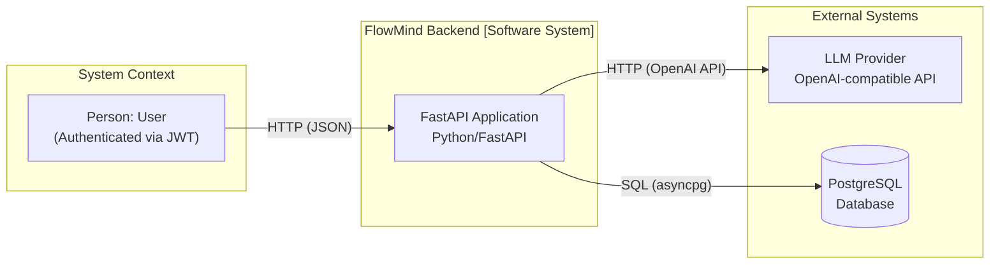
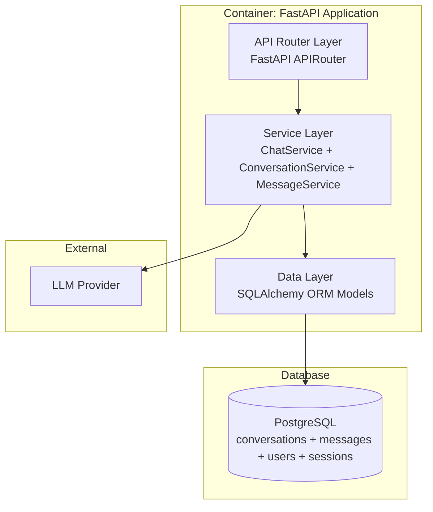
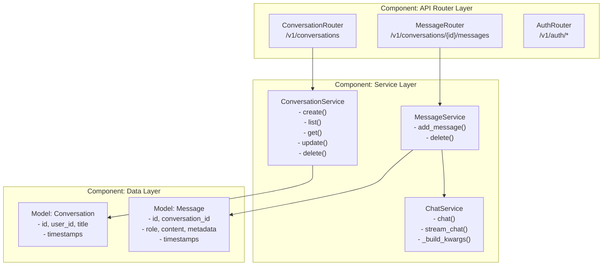

## Context

The backend currently supports stateless chat completions via `POST /v1/chat/completions`. Messages are never persisted — the client manages all conversation state in-memory. This means conversations are lost on page refresh, there is no history browsing, and users cannot resume interrupted chats. The existing stack is FastAPI + SQLAlchemy (async) + PostgreSQL, with Google OAuth for authentication and JWT session management. Two new tables (`conversations`, `messages`) and a new API surface are needed to add persistence.

## Goals / Non-Goals

**Goals:**
- Add `Conversation` and `Message` SQLAlchemy models and Alembic migration
- Provide REST CRUD endpoints for conversations (create, list, get, update title, delete) scoped to the authenticated user
- Provide endpoints to add a message to a conversation and delete a single message
- Replace the public `/v1/chat/completions` POST endpoint with an internal method — all LLM calls go through `POST /v1/conversations/{id}/messages` which persists automatically
- Client sends only the new user message; backend fetches full conversation history from DB
- All endpoints authenticated via existing JWT middleware

**Non-Goals:**
- No branching, forking, or versioning of conversations
- No shared/multi-user conversations
- No message editing
- No streaming in the first iteration of the new endpoint (streaming can be added later)

## Decisions

### D1: New `ConversationService` and `MessageService` classes

Conversation and message logic lives in dedicated service classes rather than being mixed into `ChatService`.

- **Rationale**: Separation of concerns — `ChatService` already handles LLM interaction. Persistence logic is a distinct responsibility with its own failure modes (DB errors, rollback concerns).
- **Alternative considered**: Adding persistence directly to `ChatService` — rejected because it would couple LLM orchestration with data access, making testing harder and violating SRP.

### D2: Fetch full history from DB on message add

When `POST /v1/conversations/{id}/messages` is called, the backend loads all prior messages from the database before calling the LLM.

- **Rationale**: DB is the source of truth. Avoids client synchronization issues (stale state, multiple tabs, reconnection).
- **Alternative considered**: Client sends full message array each time — rejected due to sync complexity and wasted bandwidth.
- **Cost**: `SELECT * FROM messages WHERE conversation_id = ? ORDER BY created_at` with a B-tree index on `(conversation_id, created_at)` is negligible (sub-millisecond for typical conversation sizes).

### D3: Cascade delete from conversation to messages

Deleting a conversation deletes all its messages via SQL foreign-key `ON DELETE CASCADE`.

- **Rationale**: Orphaned messages are meaningless without their conversation. Simplifies cleanup — one API call removes everything.
- **Alternative considered**: Soft delete with `deleted_at` — excessive for this use case; adds query complexity for every list/get call.

### D4: Internal chat completion call

`ChatService.chat()` and `ChatService.stream_chat()` become internal methods. The public route `/v1/chat/completions` is removed from the router but the service methods remain callable by `MessageService`.

- **Rationale**: Single entry point for LLM calls simplifies auditing, rate-limiting, and future features (e.g., token counting, billing).
- **Impact**: Existing clients that call `/v1/chat/completions` directly will break — this is an intentional **BREAKING** change documented in the proposal.

## Risks / Trade-offs

| Risk | Mitigation |
|------|-----------|
| [Large conversations] Fetching thousands of messages per request increases latency | Add pagination or a `max_history` window to `MessageService.add_message()` |
| [Race condition] Concurrent requests to `POST /v1/conversations/{id}/messages` could interleave messages out of order | Use DB-level row locking or sequence-based ordering — for now, `created_at` timestamp ordering is sufficient for single-user conversations |
| [Regressive] Removing `/v1/chat/completions` breaks existing API consumers | Document as **BREAKING**; the new endpoint path is different |

## Migration Plan

1. Add Alembic migration for `conversations` and `messages` tables
2. Add SQLAlchemy models, schemas, and service classes
3. Add new API routes alongside existing `/v1/chat/completions` (both work during transition)
4. Remove the public `/v1/chat/completions` route once clients migrate to `POST /v1/conversations/{id}/messages`
5. Rollback: restore the public `/v1/chat/completions` route and revert the migration

## Open Questions

- Should we add a `max_messages` setting to limit history sent to the LLM for very long conversations?
- Do we want streaming support on `POST /v1/conversations/{id}/messages` in v1 or defer to a follow-up?
