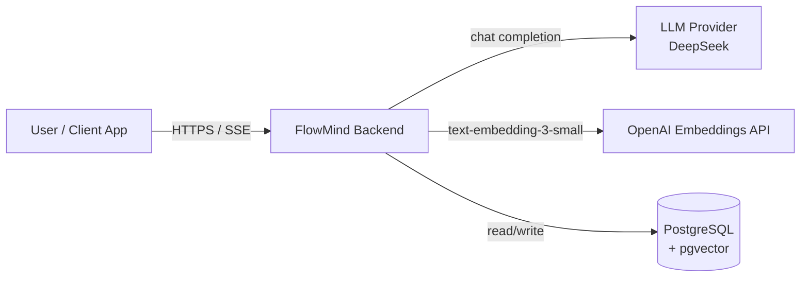
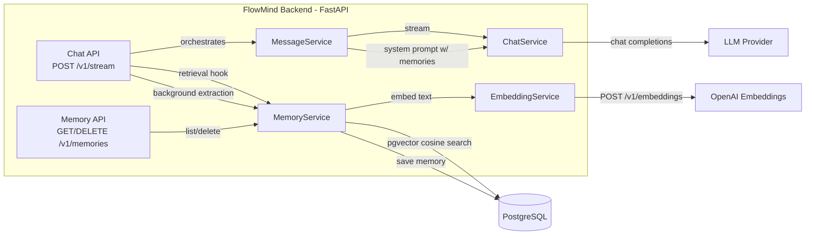
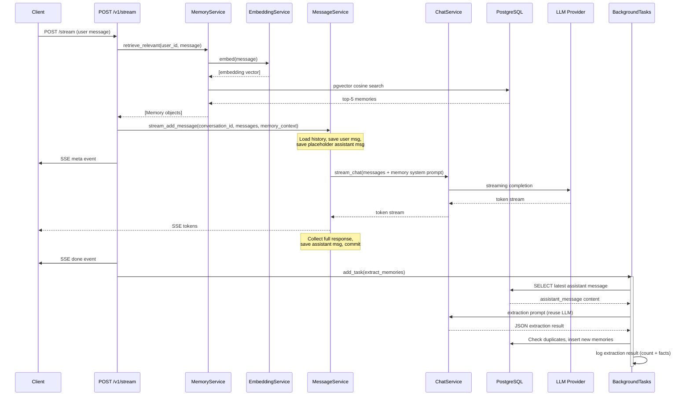

## Context

FlowMind Backend is a FastAPI application with PostgreSQL (async SQLAlchemy), JWT auth, and an OpenAI-compatible LLM provider (DeepSeek). Currently, every conversation is isolated — the LLM has no awareness of previous conversations. This design adds a long-term memory layer that extracts durable user facts from conversation exchanges and retrieves them for injection into future chat completions.

The system operates automatically: no frontend changes required, no new infrastructure (FastAPI BackgroundTasks handles async extraction), and only one new external dependency (OpenAI embeddings API).

## Goals / Non-Goals

**Goals:**
- Persist durable user facts (projects, skills, preferences, goals) in PostgreSQL with vector embeddings
- Retrieve and inject relevant memories into the LLM prompt before each chat completion
- Extract new memories automatically after each assistant response (async, non-blocking)
- Deduplicate similar memories using cosine similarity
- Expose minimal REST endpoints for memory management (list, delete)
- Follow existing project patterns (no repository layer, services use AsyncSession directly)

**Non-Goals:**
- No frontend changes — memory flows through the existing streaming API transparently
- No memory summarization, consolidation, or decay (future work)
- No user-controlled memory settings (future work via User.extra_data JSONB)
- No agent-level memory (future work)
- No changes to non-streaming endpoint (`POST /v1/conversations/{id}/messages`) extraction
- No new task queue or worker process — BackgroundTasks are sufficient for current volume

## C4 Diagrams

### System Context

The memory system introduces two new external dependencies: OpenAI Embeddings API for vector generation, and the existing LLM provider (DeepSeek) is reused for extraction.

### Container (Component-level for Memory System)

### Dynamic: Streaming Request with Memory

## Decisions

| Decision | Choice | Rationale |
|----------|--------|-----------|
| Embedding model | OpenAI `text-embedding-3-small` (1536d) | DeepSeek has no embeddings API. OpenAI provides best cost/quality for 1536d vectors. Separate `OPENAI_API_KEY` config. |
| Background extraction | FastAPI `BackgroundTasks` | Zero new infrastructure. Single process. Latency is negligible (0-5 memories per request). |
| Memory extraction method | LLM-based structured extraction | Rules-based extraction misses nuance. LLM extraction with a structured JSON prompt handles edge cases naturally. Reuses existing provider so no extra key needed. |
| Deduplication | Cosine similarity threshold (0.85) | No extra LLM cost. pgvector handles it in-database. Threshold configurable via env var. |
| Vector storage | pgvector VECTOR(1536) + HNSW index | Native PostgreSQL extension. No separate vector database. HNSW for fast approximate nearest-neighbor search. |
| Memory model | `embedding` column omitted from ORM, raw SQL for queries | `Vector` type from pgvector package can cause ORM compatibility issues. Raw SQL with `text()` is reliable and explicit. |
| Memory injection | System message prepended to messages array | Every OpenAI-compatible API supports system messages. Zero changes to ChatService. Least invasive integration point. |
| API surface | `GET /v1/memories` + `DELETE /v1/memories/{id}` | Minimal surface for MVP. Full CRUD can be added later without breaking changes. |
| Service pattern | Per-request `MemoryService(db, embedding_svc)` singleton | Follows existing `MessageService(db, chat_service)` pattern exactly. No new architectural concepts. |
| Ranking | similarity × 0.7 + (importance/10) × 0.3 | Similarity weighted higher (primary signal). Importance as tiebreaker. Tunable constants. |
| Extraction trigger | After stream completes, via BackgroundTasks | Non-blocking. User gets the streaming response instantly; extraction happens after. Extraction failure never blocks the chat. |
| Extraction logging | Log completion with count and extracted facts at INFO level | Enables manual verification of extraction timing. Operators can tail logs to confirm extraction finished before sending the next test message, avoiding the rapid-successive-message race condition. |

## Risks / Trade-offs

| Risk | Mitigation |
|------|------------|
| OpenAI embedding API outage | `EmbeddingService.embed()` returns empty list on failure. Chat works without memories. Logged as warning. |
| PostgreSQL lacks pgvector extension | Migration creates `CREATE EXTENSION IF NOT EXISTS vector`. If the binary isn't available, migration fails early with a clear error. |
| Background task DB session failure | Extraction runs in a try/except. Logged as error. Streaming response already delivered to user. Zero user-facing impact. |
| Extraction LLM returns invalid JSON | `json.JSONDecodeError` caught, logged as warning, extraction skipped for this turn. |
| Memory extraction latency (LLM call) | Only runs after response is sent (BackgroundTasks). User doesn't wait. |
| High memory count slows retrieval | HNSW index ensures approximate nearest-neighbor is O(log n). Production monitoring should alert if query time exceeds 100ms. |
| Memories persist after user deletion | `ON DELETE CASCADE` on `user_id` FK — deleting a user cascades to all their memories. |

## Migration Plan

1. **Install pgvector** — The PostgreSQL instance must have the pgvector extension installed (`CREATE EXTENSION vector;`). This is handled in the migration.
2. **Run migrations** — `alembic upgrade head` creates the `memories` table, pgvector extension, CHECK constraints, and HNSW index.
3. **Add env var** — Set `OPENAI_API_KEY` in `.env` or deployment environment.
4. **Deploy** — Rolling restart of API servers. New memory endpoints and background extraction become active immediately.
5. **Rollback** — `alembic downgrade -1` drops the `memories` table. HNSW index dropped. Memory extraction stops. Existing conversations unaffected.

## Open Questions

None. All design decisions are resolved.
