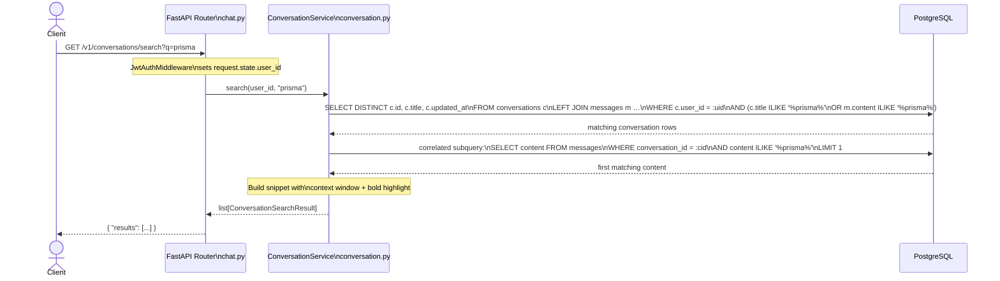

## Context

FLowMind Backend is a FastAPI application with async SQLAlchemy + PostgreSQL. Conversations and messages are stored in separate tables linked by `conversation_id`. Currently, users can only retrieve conversations by ID or list them by `user_id` — there is no content-based search.

The new endpoint adds search across conversation titles and message content using PostgreSQL `ILIKE` pattern matching, integrated into the existing three-layer architecture (route → service → model).

## Goals / Non-Goals

**Goals:**
- Expose `GET /v1/conversations/search?q=<query>` returning top 5 matches ordered by `updated_at` desc
- Search across `conversations.title`, `messages.content` (role=user or assistant)
- Return contextual snippet (`matched_text`) showing the match location
- Zero schema changes — use existing columns

**Non-Goals:**
- Full-text search with ranking (tsvector/tsquery) — punted; ILIKE is sufficient for MVP
- Pagination — limited to 5 results; revisit if usage demands it
- Fuzzy search / typo tolerance — no trigram extension or similarity matching
- Search across memory or other entities — scoped to conversations only

## Decisions

### 1. ILIKE over full-text search
ILIKE is simple, requires no extensions or indexes, and is adequate for exact substring matching. PostgreSQL's sequential scan over conversations (typically <10K per user) is fast enough at this scale. Full-text search via `to_tsvector`/`to_tsquery` can be layered on later if needed.

### 2. Correlated subquery for matched_text
A correlated scalar subquery fetches the first matching message content per conversation. This avoids in-memory post-processing and keeps the work in the database. If no message matches (only title matched), falls back to `conversations.title`.

### 3. Snippet extraction in application layer
The snippet (context window around the match) is computed in Python after fetching the raw content. This keeps the SQL simple and gives flexibility to adjust snippet formatting without SQL changes. The query word is wrapped in `<strong>` tags via case-insensitive regex substitution for frontend highlighting.

### 4. Route placed before `{conversation_id}`
FastAPI routes are matched in order. `GET /v1/conversations/search` is registered before `GET /v1/conversations/{conversation_id}` to ensure `search` is not parsed as a UUID path parameter.

## Architecture (Lightweight C4)

```mermaid
flowchart LR
  client[Client App]
  router[FastAPI Router\nchat.py]
  service[ConversationService\nconversation.py]
  db[(PostgreSQL\nconversations + messages)]

  client -->|GET /v1/conversations/search?q=prisma| router
  router -->|search(user_id, q)| service
  service -->|SQL ILIKE query| db
  db -->|matched rows| service
  service -->|truncated snippet| router
  router -->|JSON results| client
```

**Request flow:**



## Components

| Layer | File | Responsibility |
|---|---|---|
| Schema | `app/schemas/conversations.py` | `ConversationSearchResult`, `ConversationSearchResponse` Pydantic models |
| Route | `app/api/chat.py` | `GET /v1/conversations/search` handler; validates `q` param; returns response |
| Service | `app/services/conversation.py` | `search(user_id, query)` — builds SQL, executes, applies snippet logic |
| Model | `app/models.py` | Unchanged — `Conversation` and `Message` ORM models used as-is |

## Risks / Trade-offs

| Risk | Mitigation |
|---|---|
| ILIKE performance degrades as conversations grow | Add a PostgreSQL trigram index (`pg_trgm`) if profiling shows issues; the 5-result LIMIT bounds cost |
| `matched_text` returns first message rather than best match | Acceptable for MVP; could rank user messages over assistant or use relevance scoring later |
| SQL injection via `q` parameter | Parameterized queries via SQLAlchemy prevent injection; `ILIKE` pattern is bound as parameter |
| Empty or very short query returns too many results | Validate `q` is non-empty; strip whitespace |

## Migration Plan

No migration needed. Deploy the new route and service method — existing conversations and messages are immediately searchable. No rollback complexity; simply revert the code change.

## Open Questions

None. All design decisions are settled for this change.
