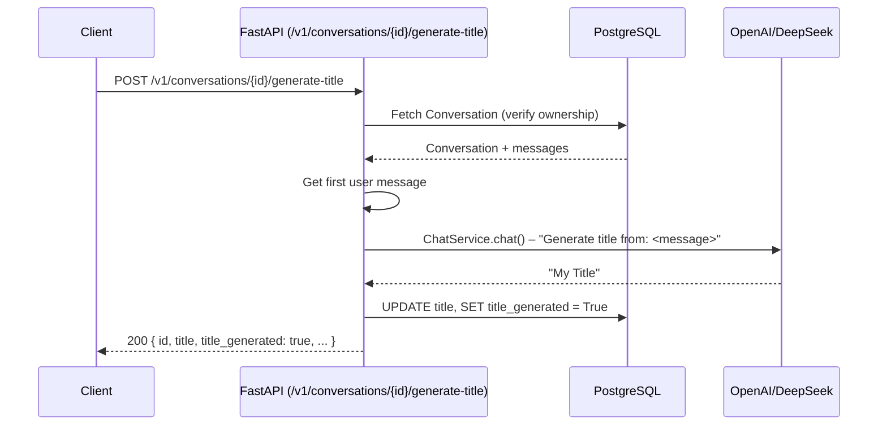

## Context

Conversations in FLowMind always show "New Conversation" as their default title. Users must manually rename conversations via `PUT /v1/conversations/{id}` to make them identifiable in the sidebar.

No existing ADRs constrain this design (all 5 ADRs relate to auth and database infrastructure).

## Goals / Non-Goals

**Goals:**
- Expose `POST /v1/conversations/{id}/generate-title` endpoint to generate a concise title from the conversation's first user + assistant exchange
- Track generation state via a `title_generated` boolean flag
- Enforce quality with a strict system prompt (examples, noun phrases, title case, 5-word max) + backend truncation guard
- Signal `title_generated` state in `ConversationResponse` schema

**Non-Goals:**
- Automatic/background title generation
- Title generation from subsequent messages beyond the first exchange
- Frontend changes

## Decisions

### Decision 1: Explicit POST endpoint over background task

Title generation is a synchronous client-triggered operation (`POST /v1/conversations/{id}/generate-title`) rather than an automatic background task. This gives the client control over when the title is generated and avoids adding latency or LLM cost to the streaming response.

### Decision 2: Boolean flag over checking title value

Adding `title_generated: bool` is more explicit and robust than checking `title == "New Conversation"`. The flag is set to `True` when the endpoint is called, and the response includes `title_generated` so the client knows the state.

### Decision 3: First user + assistant exchange for context

The title is generated from both the first user message and the first assistant response, passed as inline `User:` / `Assistant:` blocks. This gives the LLM enough context to identify the main topic rather than just echoing the user's question.

### Decision 4: Strict prompt with examples

The system prompt includes 4 worked examples, explicit requirements (noun phrases, title case, 5-word max, no punctuation/quotes), and instructions to identify the main topic — not the answer. A backend truncation guard further enforces the word limit.

### Decision 5: `title_generated` in `ConversationResponse`

The `title_generated` field is added to the `ConversationResponse` schema so clients can determine at a glance whether a title has been auto-generated vs still a default or manual title.

## Risks / Trade-offs

- **[Cost]**: Each title generation call incurs one LLM call (~50-100 tokens) → Mitigation: Client controls when to call; cost is negligible per call (~$0.0001)
- **[LLM failure]**: If the LLM call fails (timeout, API error), the endpoint returns 500 → Mitigation: The title field on the conversation is not modified on failure
- **[Empty conversation]**: If the conversation has no user messages, the endpoint returns 400 → Mitigation: Clear error message

## Migration Plan

1. Create Alembic migration adding `title_generated` column (default `False`) to `conversations` table
2. Deploy migration independently — no application changes needed
3. Deploy code change — new conversations will auto-generate titles
4. Rollback: Revert code change; column stays but is harmless (no code reads it)

## Open Questions

None. All decisions are resolved.
