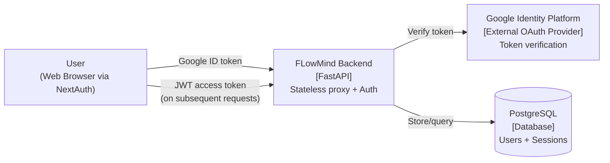
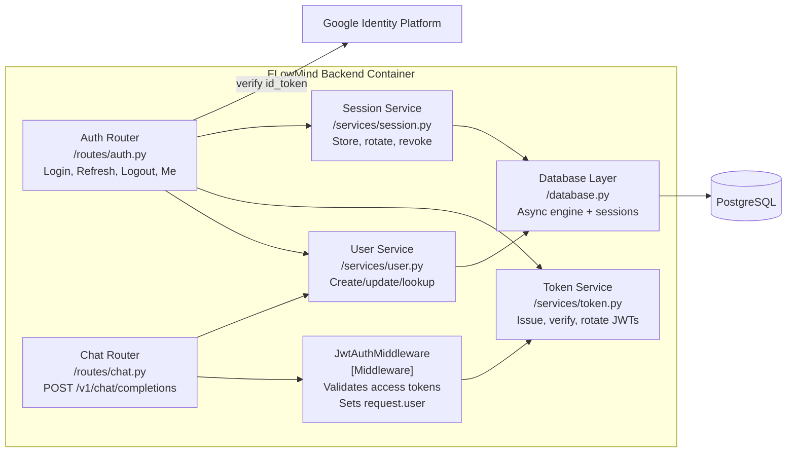

## Context

FLowMind-Backend is currently a stateless FastAPI proxy to an OpenAI-compatible LLM provider. It has a single endpoint (`POST /v1/chat/completions`), optional Bearer-token auth via `AUTH_TOKEN` env var, in-memory rate limiting, and no database or user system.

This change introduces a PostgreSQL-backed user and session system with Google OAuth authentication. The existing chat endpoint must continue working unchanged (same contract), but now protected by JWT validation instead of the legacy Bearer token.

### C4 System Context Diagram

### C4 Container Diagram

## Goals / Non-Goals

**Goals:**
- Google OAuth login via ID token verification using `google-auth`
- Auto-create or update users on login
- Issue short-lived JWT access tokens (15 min) and long-lived refresh tokens (7 days)
- Refresh token rotation — each refresh invalidates the old token and issues a new pair
- Single-session and all-sessions logout
- User profile retrieval via `GET /v1/auth/me`
- Replace existing `AuthMiddleware` with `JwtAuthMiddleware`
- All existing chat endpoint contracts preserved (same request/response shape, now requires JWT)

**Non-Goals:**
- Chat persistence, message history, or chat ownership — the auth system is designed to be compatible with these later, but no chat tables or routes are added
- Role-based access control (admin/user roles)
- Email/password registration or password management
- API key management
- OAuth provider other than Google

## Decisions

| Decision | Choice | Rationale | Alternatives Considered |
|---|---|---|---|
| Database | PostgreSQL + async SQLAlchemy | Production-grade, async-native, Alembic migrations, future chat persistence needs a real DB | SQLite (not concurrent), Redis-only (no relational queries) |
| Token verification | `google-auth` library | Google-official, handles JWKS fetch, signature verification, expiry, and audience checks | `authlib` (more setup), manual PyJWT + JWKS (more code, JSE risk) |
| JWT algorithm | HS256 with `JWT_SECRET` env var | Simple, fast, single-service deployment. Secret never leaves this service | RS256 (overkill for single service), auto-generated secret (stateful) |
| Access token expiry | 15 minutes | Limits breach window. Short enough to be safe, long enough to avoid excessive refreshes | 5 min (too chatty), 1 hour (too long) |
| Refresh token expiry | 7 days | Good balance between security and UX for a chat application | 30 days (too long for early stage), no refresh (poor UX) |
| Refresh rotation | Yes (invalidate on use) | Standard OAuth2 security — limits damage if a refresh token is stolen | No rotation (less secure) |
| User model | Minimal + JSON metadata | Avoids premature schema commitment; arbitrary future fields go in metadata JSONB | Full column set from start (churn), bare minimum (too inflexible) |
| Session model | Separate table with hashed tokens | Enables multi-device, audit trail, and selective revocation | Embedded in user row (no multi-device), Redis (extra dependency) |
| Middleware strategy | Replace AuthMiddleware with JwtMiddleware | Clean break, simpler mental model, no dual-path bugs | Dual support (complexity), route-based selection (fragile config) |
| Token storage in DB | Hash refresh tokens with SHA-256 | Refresh tokens are bearer credentials — never store plaintext | Plaintext (security risk), encrypted (key management overhead) |

## Risks / Trade-offs

| Risk | Mitigation |
|---|---|
| **New PostgreSQL dependency** — operations team must manage a database server, connection pooling, backups | Use async SQLAlchemy with connection pooling. Document minimal PostgreSQL config in deployment guide. Alembic migrations are self-contained. |
| **Database connection failure** — if PostgreSQL is down, all auth endpoints and protected routes fail | Fail closed (401). Health check endpoint remains public. Add a `GET /health` that checks DB connectivity. |
| **Refresh token collision on rotation** — two concurrent refresh requests could both succeed, both issued valid tokens | Accept this edge case (same as OAuth2 spec). The old token is invalidated immediately. If both succeed, the user gets two valid refresh tokens — acceptable for this use case. |
| **Clock skew** — JWT validation relies on server time | PyJWT allows `leeway` config (default 30s). Set `leeway=10` in configuration. |
| **Migration from old auth** — existing clients using `AUTH_TOKEN` break | Announce breaking change. The old `AUTH_TOKEN` env var is kept during a transition period but deprecated. |
| **Google token verification latency** — `google-auth` fetches JWKS from Google on first call | JWKS is cached by `google-auth` library. Warm cache reduces subsequent calls to zero network latency. |

## Migration Plan

1. **Add new env vars** to `.env.example`: `DATABASE_URL`, `GOOGLE_CLIENT_ID`, `JWT_SECRET`. Mark `AUTH_TOKEN` as deprecated.
2. **Add dependencies** to `pyproject.toml`: `sqlalchemy[asyncio]`, `asyncpg`, `alembic`, `google-auth`, `PyJWT`.
3. **Create database layer**: async engine, session factory, Alembic init with first migration (User + Session tables).
4. **Implement models** and services in parallel: User model, Session model, TokenService, UserService, SessionService.
5. **Implement auth routes**: all four endpoints behind a public router (no JWT middleware on auth routes).
6. **Replace middleware**: swap `AuthMiddleware` for `JwtAuthMiddleware` in the middleware stack. Auth routes are excluded from JWT checks via route matching.
7. **Update tests**: replace old auth mocks, add integration tests for all auth flows.
8. **Drop `AUTH_TOKEN`** after transition window.

**Rollback**: Remove new middleware, re-add old `AuthMiddleware`, roll back DB migration, revert `pyproject.toml`.

## Open Questions

- Should the `GET /health` endpoint remain public, or require a valid JWT? — Currently assumed public (for load balancer checks).
- Should the `POST /v1/auth/google` endpoint be rate-limited differently from chat? — Probably yes, but can be tuned post-launch.
- Should the refresh token be sent in the request body or as an `Authorization: Bearer` header? — Assumed request body (`{ "refresh_token": "..." }`) to avoid confusion with access token header.
