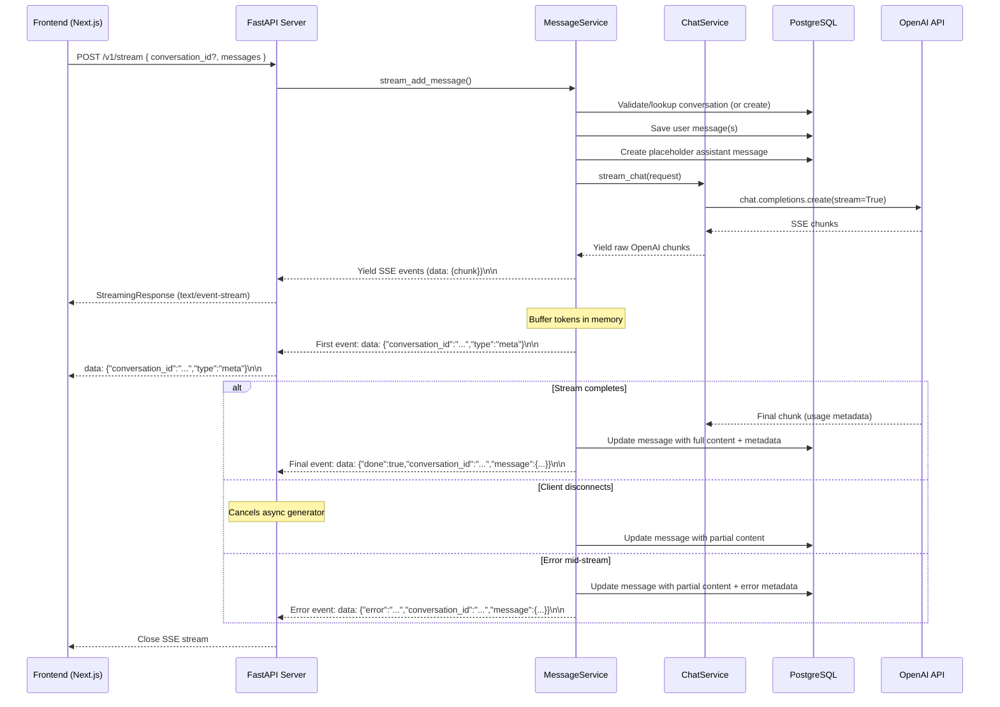

## Context

The message API (`POST /v1/conversations/{id}/messages`) uses `ChatService.chat()` — a blocking call that waits for the full OpenAI response before returning. `ChatService.stream_chat()` already exists and yields SSE-formatted OpenAI chunks, but is unreachable from the API. The frontend ADR (`0002`) specifies native `fetch` + `ReadableStream` + `AbortController` for streaming consumption.

This design adds a dedicated streaming endpoint that leverages the existing streaming service, with buffer-and-persist semantics.

## Goals / Non-Goals

**Goals:**
- Provide SSE-based real-time token delivery for assistant responses
- Save user messages and assistant messages in a single request
- Buffer tokens server-side, persist on stream completion (or partial on error/disconnect)
- Support client-initiated cancellation (disconnect detection)
- Implicit conversation creation (optional `conversation_id` in body)
- Keep existing `POST /v1/conversations/{id}/messages` unchanged

**Non-Goals:**
- WebSocket or alternative transport — SSE via `StreamingResponse` is sufficient
- Streaming into DB (no partial rows updates during streaming)
- Multi-model selection (uses the same model as configured in settings)

## Decisions

### Decision 1: New `POST /v1/stream` endpoint (not modifying existing)

| Option | Verdict |
|---|---|
| Modify existing `POST /v1/conversations/{id}/messages` | Rejected — would break non-streaming clients; complexity of dual-mode endpoint |
| **New `POST /v1/stream` (chosen)** | Clean separation; always streams; `conversation_id` optional in body |

The new endpoint is decoupled from the existing conversation-path approach, allowing the frontend to send a single payload (`{ conversation_id?, messages }`) without needing to know whether a conversation exists.

### Decision 2: conversation_id in body (optional), auto-create

| Option | Verdict |
|---|---|
| Path param (like existing endpoint) | Rejected — path param can't be optional; requires client to know/create conversation ID first |
| **Body field (chosen)** | Client can omit to create a new conversation, or provide an existing ID |

### Decision 3: SSE with raw OpenAI chunk passthrough

| Option | Verdict |
|---|---|
| **Raw OpenAI chunks (chosen)** | Frontend already has ADR for native `fetch` + `ReadableStream`; raw chunks give maximal flexibility and match existing `stream_chat()` output |
| Simplify to content-only tokens | Rejected — loses delta metadata (function calls, tool calls, finish reason) |

### Decision 4: Buffer then save (with partial save on failure)

| Option | Verdict |
|---|---|
| **Buffer then save (chosen)** | Buffer tokens in memory; create placeholder message record at stream start; on completion/failure/disconnect, update with accumulated content |
| Stream into DB | Rejected — unnecessary I/O; partial rows in DB complicate state |
| Frontend persists | Rejected — defeats server-authoritative message storage |

### Decision 5: conversation_id emitted as first SSE event

The first event in the stream carries `conversation_id` at the root — critical when the conversation is auto-created (no `conversation_id` in the request). This lets the client immediately know which conversation to display/navigate to. The `conversation_id` also appears in the final done/error events for redundancy.

### Decision 6: Client cancellation support

The server detects disconnect via `StreamingResponse` — FastAPI/Starlette handles client disconnect by cancelling the async generator. The generator's `finally` block persists whatever was accumulated. No custom heartbeat or keepalive required.

### C4 Container Diagram (Streaming Flow)

## Risks / Trade-offs

| Risk | Mitigation |
|---|---|
| **Memory pressure** — long responses buffer full content in memory | Single-user context; max tokens is bounded by model context window (~16K-128K tokens); content freed after DB write |
| **Client disconnect not detected promptly** — generator continues running | FastAPI's `StreamingResponse` cancels generator on disconnect; add safe fallback timeout as second layer |
| **Orphan placeholder messages** — if server crashes mid-stream before update | Not realistically avoidable; placeholder has empty content and can be cleaned up via periodic job or ignored |
| **Race condition on conversation creation** — two simultaneous stream requests with no conversation_id could create duplicate conversations | Unlikely in practice (client typically creates one conversation); if it becomes an issue, add client-generated idempotency key |

## Migration Plan

1. Implement `MessageService.stream_add_message()` and `POST /v1/stream` route
2. Deploy — no schema migration required (existing `messages` table unchanged)
3. Frontend switches from existing endpoint to `POST /v1/stream` for new conversations
4. Old endpoint remains for backward compatibility; can be deprecated later

Rollback: remove `POST /v1/stream` route; frontend falls back to existing endpoint.

## Open Questions

- None currently — ADR 0002 (native fetch streaming) already covers the frontend transport choice and remains in force
