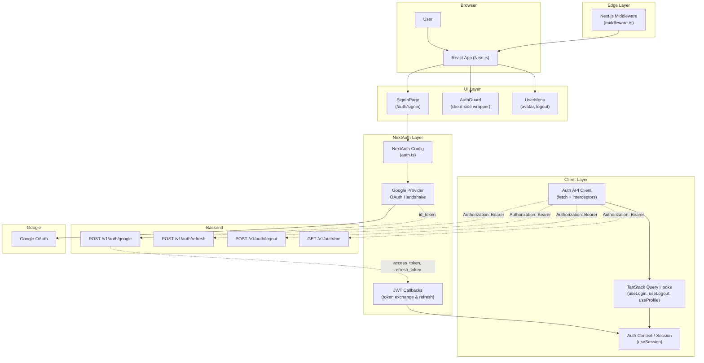

## Context

FlowMind is a Next.js 16.2.9 (App Router) chat application with React 19, Tailwind CSS v4, and shadcn/ui (base-nova style, base-ui primitives). It currently has no authentication — the app is fully public.

The backend exposes auth APIs:
- `POST /v1/auth/google` — exchange Google `id_token` for `{ access_token, refresh_token, user }`
- `POST /v1/auth/refresh` — refresh tokens
- `POST /v1/auth/logout` — revoke session
- `GET /v1/auth/me` — current user profile from access token

No existing auth infrastructure exists in the frontend. This design introduces Google OAuth sign-in via NextAuth, with backend-issued JWT delegation.

## Goals / Non-Goals

**Goals:**
- Google OAuth sign-in flow via NextAuth
- Backend JWT delegation — exchange Google ID token for backend-issued access/refresh tokens
- Middleware-based route protection (root `/` protected, `/auth/*` public)
- Reusable auth API client with automatic token injection and 401 interception
- TanStack Query hooks for auth state management (login, logout, profile)
- Sign-in page at `/auth/signin` with modern UI (`@magicui/animated-grid-pattern`)
- Strict TypeScript — no `any` in auth code
- Clean `features/auth/` folder structure

**Non-Goals:**
- Email/password or other OAuth providers (future)
- User registration flow
- Role-based authorization or permissions
- Multi-tenant support
- Backend implementation (assumed existing)

## Architecture



### Data Flow (Sign-In)

1. User clicks "Sign in with Google" on `/auth/signin`
2. NextAuth Google provider initiates OAuth handshake
3. On callback, NextAuth receives Google profile + `id_token`
4. `jwt` callback calls `POST /v1/auth/google` with `{ id_token }`
5. Backend returns `{ access_token, refresh_token, user }`
6. NextAuth stores tokens in encrypted JWT session cookie
7. `session` callback exposes `accessToken` + `user` to client
8. User redirected to `/` (now authenticated)

### Data Flow (Auth API Client)

1. `auth-api-client` is a fetch wrapper
2. Before each request, reads `accessToken` from NextAuth session
3. Sets `Authorization: Bearer <token>` header
4. On 401 response, attempts token refresh via `POST /v1/auth/refresh` using `refresh_token` from session
5. If refresh succeeds, retries original request
6. If refresh fails, signs user out and redirects to `/auth/signin`

## UI/UX Design System

### Design Direction

Clean, modern sign-in experience using the project's existing shadcn base-nova theme. The sign-in page is deliberately minimal — a single Google sign-in button centered on a card with an animated grid background. No clutter, no nav, no footer. The page's single job is authentication.

### Component Layout

```
┌─────────────────────────────────────────────┐
│  ▼ AnimatedGridPattern (full-page background)│
│                                             │
│            ┌───────────────────┐            │
│            │                   │            │
│            │    Brand Icon     │            │
│            │                   │            │
│            │   Sign in to      │            │
│            │    FlowMind       │            │
│            │                   │            │
│            │ [Sign in with    ]│            │
│            │ [    Google      ]│            │
│            │                   │            │
│            │  Error banner     │            │
│            │  (conditional)    │            │
│            │                   │            │
│            └───────────────────┘            │
│                                             │
└─────────────────────────────────────────────┘
```

### Color Palette

Uses existing shadcn base-nova theme tokens (`--color-background`, `--color-foreground`, `--color-primary`, etc.). No custom colors — the existing neutral theme is sufficient for a clean sign-in page. The animated grid uses `fill-gray-400/30 stroke-gray-400/30` with `maxOpacity: 0.5` for subtle visual texture.

### Typography

Uses the project's existing Geist font stack (set by base-nova preset). No additional font imports needed.

### UX Guidelines

- Google button uses the existing `Button` component with `variant="outline"` and a Google SVG icon
- Loading state: button shows a spinner and becomes `disabled` during OAuth redirect
- Error state: inline error banner below the button using existing `Alert` pattern
- Callback URL: captures `callbackUrl` query param, defaults to `/` after sign-in
- Already authenticated: middleware redirects away from `/auth/signin` to `/`
- Focus states: visible keyboard focus on all interactive elements
- Reduced motion: `prefers-reduced-motion` respected (grid animation disabled)

## Decisions

| Decision | Choice | Rationale | Alternatives |
|----------|--------|-----------|--------------|
| Auth framework | NextAuth (Credentials + Google provider) | Built-in OAuth, JWT callbacks, session management; de facto Next.js auth standard | Lucia, Auth0, Clerk |
| Token storage | NextAuth encrypted JWT session cookie | No localStorage XSS vector; automatic cookie management | localStorage (XSS risk) |
| JWT strategy | JWT strategy (not database) | No database needed; tokens already backend-managed | Database session strategy |
| API client | Native fetch wrapper | Zero dependencies; matches existing `lib/chat.ts` fetch usage | Axios (extra dependency) |
| Route protection | Next.js middleware | Runs at edge, fast redirects, no client-side flash | Client-only guard (slow, flash) |
| Auth state | TanStack Query + NextAuth `useSession` | TQ for mutations (login/logout), NextAuth for session reads | Redux, Zustand |
| Folder structure | `features/auth/` | Colocation by domain; scalable as features grow | Flat `auth/` or co-located in `app/` |
| Sign-in background | `@magicui/animated-grid-pattern` | Modern, subtle motion without being distracting | Static gradient, particle effect |

## Risks / Trade-offs

- [NextAuth JWT size] NextAuth JWT cookies hold access + refresh tokens. Backend tokens longer than ~4KB may exceed cookie limits → Mitigation: monitor cookie size, trim `user` object to essentials
- [Refresh race condition] Multiple concurrent API calls may all 401 simultaneously, triggering parallel refreshes → Mitigation: queue refresh promise, deduplicate concurrent refresh attempts
- [Google token expiration] The Google `id_token` is used only once during the initial exchange. If the exchange fails (network), user must re-authenticate via Google → Mitigation: retry exchange with exponential backoff in the `jwt` callback
- [Middleware redirect loop] Misconfigured route matcher could cause infinite redirects between `/` and `/auth/signin` → Mitigation: precise `matcher` config in middleware, exclude static assets and Next.js internals

## Migration Plan

1. Install dependencies: `next-auth`, `@tanstack/react-query`, `@tanstack/react-query-devtools` (dev)
2. Add environment variables: `AUTH_SECRET`, `AUTH_GOOGLE_ID`, `AUTH_GOOGLE_SECRET`, `NEXT_PUBLIC_API_URL`
3. Create `features/auth/` directory structure
4. Implement NextAuth config (`auth.ts`) with Google provider + JWT callbacks
5. Implement auth API client (`features/auth/api/auth-client.ts`)
6. Create TanStack Query provider and auth hooks
7. Build sign-in page at `app/auth/signin/page.tsx`
8. Implement middleware at `src/middleware.ts`
9. Create `AuthGuard` client component
10. Wire up layout with `SessionProvider` and TanStack `QueryClientProvider`
11. Test full flow: Google sign-in → token exchange → protected route → token refresh → sign-out

Rollback: Remove `next-auth` config, middleware, and provider wrappers. Keep `features/auth/` directory for future re-enablement.

## Open Questions

- Should the root layout wrap all pages in `SessionProvider` and `QueryClientProvider`, or only protected routes?
- What is the exact Google OAuth client ID / secret source (env vars expected, no issues)
- Should the middleware `matcher` include all routes or be explicit about `/` only?
