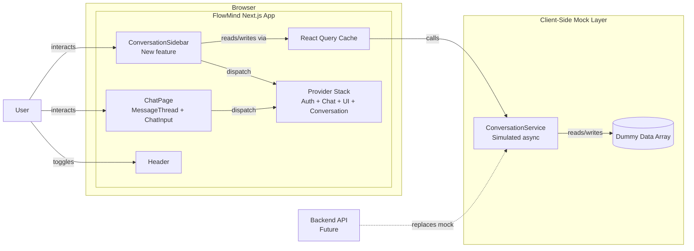
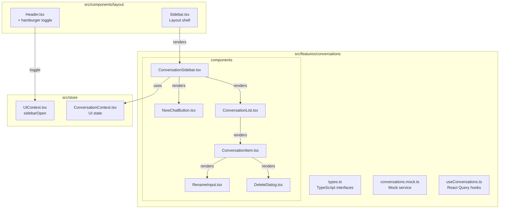

## Context

FlowMind is a single-page AI chat application (Next.js 16 + React 19, App Router) with Google OAuth authentication. The current architecture has no conversation management — messages live in a single ephemeral array in `ChatContext` (React Context + useReducer), lost on page refresh. The codebase already anticipates a sidebar via `UIState.sidebarOpen` and `TOGGLE_SIDEBAR`/`CLOSE_SIDEBAR` actions in `uiReducer.ts`, but no Sidebar component is rendered. The design system is minimal: white background (`#FFFFFF`), near-black text (`#171717`), Inter font, with Base UI primitives wrapped in shadcn-style `cn()` utility components.

This design covers adding a ChatGPT-style conversation sidebar with mock data, conversation CRUD, and responsive mobile support — all without altering the existing chat architecture, auth flow, or streaming mechanism.

## Goals / Non-Goals

**Goals:**
- Add a 280px persistent desktop sidebar (collapsible) and mobile overlay drawer with animated slide transitions
- "New Chat" button in a dedicated top section that clears the thread without creating a conversation entry
- Scrollable conversation list with title + relative timestamp, active highlighting, hover-revealed rename (inline edit) and delete (confirmation dialog)
- Mock service layer with simulated async delays powering loading skeletons and empty states
- Active conversation tracked via URL search param (`?conversation=uuid`) synced with `ConversationProvider` state
- Hamburger toggle in the existing `Header` component

**Non-Goals:**
- Real backend API integration (mock service is designed for drop-in replacement)
- Message persistence or loading messages from a backend
- Dark mode support (no dark mode CSS exists; deferred)
- Changing the existing chat streaming, auth flow, or `ChatContext` reducer
- Drag-and-drop reordering, conversation search, or bulk operations
- Conversation pinning, archiving, or organization features

## Architecture

### Container Diagram



### Component Architecture



### Provider Nesting Order

```
SessionProvider → QueryClientProvider → AppProvider → AuthProvider → ConversationProvider → UIProvider → Layout
```

`ConversationProvider` wraps `UIProvider` because sidebar state (`ConversationContext`) should be available before UI actions are dispatched.

### Data Flow

```
User clicks sidebar conversation
  → ConversationItem.onClick(conversationId)
  → urlSearchParams.set("conversation", conversationId)
  → ConversationProvider dispatches SET_ACTIVE
  → ChatPage reads ?conversation= from URL
  → Clear/load messages for active conversation

User clicks New Chat
  → router.push("/") (clears ?conversation=)
  → ConversationProvider dispatches CLEAR_ACTIVE
  → ChatPage shows empty state

User renames conversation
  → RenameInput.onSubmit(title)
  → useMutation({ mutationFn: renameConversation })
  → Mock service updates, invalidates query cache
  → List re-renders with new title

User deletes conversation
  → DeleteDialog triggers useMutation({ mutationFn: deleteConversation })
  → If deleted was active, clear active + redirect to "/"
  → Mock service removes, invalidates query cache
```

## UI/UX Design System

### Design Direction

The sidebar extends FlowMind's existing minimal, functional aesthetic. It should feel like a natural extension of the interface — not a separate feature. The design language is Swiss/functional: clean lines, generous whitespace, high contrast, no ornamentation. The sidebar is utilitarian: a tool for navigation, not a canvas for brand expression.

### Color Palette

Matched to the existing FlowMind design system:

| Token | Hex | Usage |
|-------|-----|-------|
| Background | `#FFFFFF` | Sidebar background, page background |
| Foreground | `#171717` | Primary text, active item text |
| Subtle Text | `#737373` | Conversation timestamps, secondary info |
| Border | `#E5E5E5` | Separator lines, input borders |
| Surface Hover | `#F5F5F5` | Hovered conversation item background |
| Surface Active | `#EBEBEB` | Active conversation item background, selected state |
| Accent | `#2563EB` | "New Chat" button background, focus rings |

Existing project tokens from `globals.css`: `--background: #ffffff`, `--foreground: #171717`.

### Typography

**Font:** Inter (variable) — already the recommendation matching FlowMind's minimal, functional aesthetic.

| Role | Size | Weight | Line Height | Usage |
|------|------|--------|-------------|-------|
| Sidebar title | 14px | 500 | 20px | Conversation item titles |
| Timestamp | 12px | 400 | 16px | Relative timestamps ("2h ago") |
| Button text | 14px | 500 | 20px | "New Chat" button |
| Empty state | 13px | 400 | 18px | "No conversations" message |
| Dialog title | 16px | 600 | 24px | Delete confirmation heading |

### Spacing & Layout

| Token | Value | Usage |
|-------|-------|-------|
| Sidebar width | `280px` | Persistent desktop sidebar |
| Sidebar padding | `12px` (px-3) | Inner horizontal padding |
| Item height | `40px` | Conversation item row |
| Item border radius | `8px` (rounded-lg) | Conversation item hover/active pill |
| Item gap | `2px` | Vertical gap between items |
| Section padding | `12px` top, `8px` bottom | "New Chat" section |
| Icon size | `16px` (w-4 h-4) | Action icons, lucide-react |
| Hamburger size | `20px` (w-5 h-5) | Header toggle icon |

### Responsive Breakpoints

| Breakpoint | Sidebar Behavior |
|------------|-----------------|
| `< 768px` (mobile) | Hidden by default. Overlay drawer slides in from left with `fixed` positioning, full-height, with `bg-black/50` backdrop. Close on backdrop tap or hamburger toggle. |
| `>= 768px` (desktop) | Persistent sidebar, collapsible via hamburger. When collapsed, chat area fills the full width. Sidebar `w-[280px]` transitions to `w-0` with overflow hidden. |

Page layout shifts with sidebar: `ml-0` when collapsed, `ml-[280px]` when expanded.

### Component Patterns

**Conversation Item:**
```
┌──────────────────────────────────┐
│ [title text...]      [2h ago]    │  ← Default: title (14px, #171717), timestamp (12px, #737373)
│ ─ ─ ─ ─ ─ ─ ─ ─ ─ ─ ─ ─ ─ ─ ─ │  ← Hover: bg-[#F5F5F5], icons fade in
│ [title text...]  [✎] [🗑]        │  ← Hover + active state
│ [title text...]      [2h ago]    │  ← Active: bg-[#EBEBEB], font-medium
└──────────────────────────────────┘
```

**New Chat Button:**
Styled as a pill — `bg-[#F5F5F5]` default, `bg-[#E5E5E5]` hover, left-aligned icon + text. Full width within sidebar padding.

```text
┌ ─ ─ ─ ─ ─ ─ ─ ─ ─ ─ ─ ─ ─ ┐
│ [+  New Chat            ]  │
└ ─ ─ ─ ─ ─ ─ ─ ─ ─ ─ ─ ─ ─ ┘
```

**Rename Input:**
Inline replacement of the title text — a borderless input that auto-focuses, with Enter to save and Esc to cancel. `text-sm`, matches item height.

**Delete Dialog:**
Base UI `Dialog` primitive (already available via `@base-ui/react`). Shows "Delete conversation?" heading, "This action cannot be undone." body, Cancel (secondary button) and Delete (destructive button) actions.

**Empty State:**
Centered in the sidebar's remaining height. `MessageSquare` icon (16px, `#737373`), "No conversations" text (13px, `#737373`), "Start a new chat" subtext (12px, `#A3A3A3`).

**Loading State:**
3-5 skeleton rows matching item height (40px) with rounded pills, pulsing `bg-[#F5F5F5]` with `animate-pulse`.

### UX Guidelines

- **Active conversation auto-scrolls into view** when the sidebar opens or active ID changes
- **Escape key** dismisses rename input (reverts title) and closes mobile sidebar
- **Click outside** closes mobile sidebar (backdrop tap) and dismisses rename input
- **Focus trap** in delete dialog: Tab cycles within dialog, Escape closes
- **`prefers-reduced-motion`** respected: disable slide animations, instant show/hide
- **Keyboard navigation**: Arrow keys navigate conversation items when sidebar is focused
- **Back button** on mobile: closing the sidebar via backdrop does NOT add a history entry; hamburger toggle is state-only

## Decisions

### D1: Feature folder structure (`src/features/conversations/`)

**Rationale:** The codebase already uses feature folders (e.g., `src/features/auth/`, `src/features/chat/`). Colocating types, mock service, hooks, and components keeps the feature self-contained. The sidebar shell at `src/components/layout/Sidebar.tsx` is a thin layout wrapper that composes feature components.

**Alternatives considered:** Putting everything in `src/components/` — rejected because it scatters concerns and breaks the established feature-folder pattern.

### D2: Mock service with simulated async delays

**Rationale:** Building against an async service layer from day one means loading skeletons, empty states, and error handling are genuine, tested flows — not retrofitted stubs. The service exposes the same interface the real API client will (`getConversations`, `createConversation`, `updateConversation`, `deleteConversation`), making the swap trivial.

**Alternatives considered:** Static import of a mock array — rejected because loading/empty states would be fake (instant render, no transitions).

### D3: Dual state management — ConversationProvider + React Query

**Rationale:** Conversations are server state (list, CRUD) → React Query handles caching, invalidation, loading/error states. Active conversation ID and sidebar open/close are UI state → React Context + useReducer. This separation prevents UI ephemera from polluting the query cache and lets React Query optimize refetching.

**Alternatives considered:** Single Context for everything — rejected because React Query already exists in the app and excels at server state. Pure React Query for UI state — rejected because `sidebarOpen` and `activeConversationId` are not server data.

### D4: URL search param for active conversation

**Rationale:** `?conversation=uuid` makes the active conversation shareable, bookmarkable, and refresh-resilient without changing routing architecture. Browser back/forward navigates conversation history. No new routes or route groups needed.

**Alternatives considered:** State-only tracking — rejected because refresh loses context. URL path segment (`/chat/[id]`) — rejected because it requires restructuring route groups and layouts, which the proposal explicitly rules out.

### D5: New Chat clears thread, creates on first message

**Rationale:** Matches ChatGPT's behavior and the user's stated backend flow. Prematurely creating conversations when the user hasn't sent a message clutters the sidebar with empty entries. The conversation entry only materializes when there's content.

**Alternatives considered:** Create on "New Chat" click — rejected because it creates empty, valueless entries.

### D6: Inline rename, confirmation dialog for delete

**Rationale:** Rename is low-stakes and benefits from speed — inline edit removes friction. Delete is destructive — confirmation dialog prevents accidents. This balances ChatGPT-style efficiency with safety.

**Alternatives considered:** Dialog for rename — slower, unnecessary friction. Immediate delete with undo — rejected by user preference for explicit confirmation.

### D7: Hamburger in Header, leveraging existing UIState

**Rationale:** The `UIState.sidebarOpen` and `TOGGLE_SIDEBAR`/`CLOSE_SIDEBAR` actions already exist in `uiReducer.ts`. Adding a hamburger icon to `Header.tsx` wires them up with zero new state infrastructure. The header currently has FlowMind text on the left — the hamburger sits to its left.

**Alternatives considered:** Separate toggle button outside Header — rejected because it breaks the established layout pattern.

### D8: 280px sidebar width, 768px breakpoint

**Rationale:** 280px is the ChatGPT/Claude standard — wide enough for readable titles and action icons, narrow enough to preserve chat space. 768px (`md:` in Tailwind) is the standard tablet/desktop threshold already used in the codebase for responsive behavior.

**Alternatives considered:** 260px — slightly cramped for timestamps. 300px+ — eats into chat width on smaller desktops.

## Risks / Trade-offs

| Risk | Impact | Mitigation |
|------|--------|------------|
| Mock service diverges from real API contract | Frontend built against wrong data shapes, rework needed when backend integrates | TypeScript interfaces match Pydantic models exactly from the provided data model schema |
| URL search param approach limits to one active conversation per tab | Cannot show two conversations side by side | This is not a required use case; single-conversation model matches ChatGPT |
| `ConversationProvider` adds another context to the provider stack | Increased nesting depth, potential render cascade | Provider is lightweight (only `activeConversationId` + dispatch); React 19 context optimizations handle this |
| Mobile sidebar overlay may conflict with mobile keyboard when chat input is focused | Sidebar slides over content including the input, potentially janky on focus/blur | Close sidebar when chat input focuses on mobile; standard pattern in chat apps |
| No dark mode support | Sidebar won't render correctly if dark mode is added later | Palette uses semantic tokens (`--background`, `--foreground`) from globals.css where available; custom colors are sidebar-specific and easy to dark-mode adapt later |

## Migration Plan

1. **Phase 1 — Types & Mock Service:** Create `src/features/conversations/types.ts` and `conversations.mock.ts`. No UI changes. Can be merged independently.
2. **Phase 2 — Provider & Hooks:** Add `ConversationProvider` and React Query hooks. Wire into provider stack. No visible change yet.
3. **Phase 3 — Sidebar UI:** Create all components in `src/features/conversations/components/` and the layout shell at `src/components/layout/Sidebar.tsx`. Render in root layout.
4. **Phase 4 — Header Integration:** Add hamburger button to `Header.tsx`, wired to existing `UIState` actions.
5. **Phase 5 — Chat Page Integration:** Sync `?conversation=` param with conversation switching; wire "New Chat" to clear thread.

**Rollback:** Each phase is additive. Sidebar can be toggled off via `UIState.sidebarOpen` defaulting to `false`. Removing the sidebar component reverts to current state with no other side effects.

**Real API swap:** Replace `conversations.mock.ts` with an API client following the `AuthApiClient` pattern. React Query hooks are interface-compatible — only the service import changes.

## Open Questions

- **Q1:** Should the "New Chat" button create a blank conversation in the sidebar list (grayed out, titled "New Conversation") or remain entirely ephemeral? Current design: ephemeral. Awaiting user confirmation on visual preference.
- **Q2:** When the real backend API is integrated, should the conversation list be paginated or infinite scroll? Mock service returns all items. Design should note this for future.
- **Q3:** Should conversations be user-scoped (each user sees only their own) from the mock phase, or all conversations visible to all users? Mock service is currently global.
