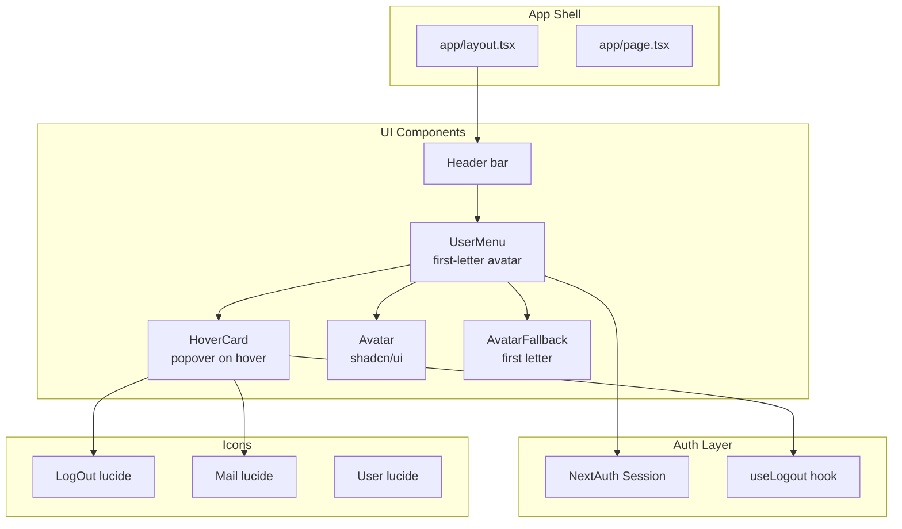

## Context

The chat page currently has no user identification or logout mechanism. An existing `UserMenu` component (`features/auth/components/user-menu.tsx`) is fully built but never imported anywhere. It renders an avatar image (or `User` icon fallback), user's display name, and an inline "Sign out" button. The root layout (`app/layout.tsx`) is minimal — just `<AuthProviders>{children}</AuthProviders>` with no header.

ADR 0002 (native fetch for streaming) is irrelevant here. ADR 0001 (shadcn/ui + Tailwind) commits us to using shadcn UI primitives — this design uses shadcn's `HoverCard` and `Avatar` components.

## Goals / Non-Goals

**Goals:**
- Show a first-letter initial avatar in the top-right corner of every page
- On hover, display a card with user's display name, email, and a logout button
- Use existing session data from NextAuth (no new API calls)
- Reuse and enhance the existing `UserMenu` component
- Add a persistent header bar to the root layout

**Non-Goals:**
- No new API endpoints or backend changes
- No changes to authentication logic
- No mobile responsiveness changes beyond basic header layout

## Architecture



**Component tree:**
```
<RootLayout>
  <AuthProviders>
    <header>                    ← new: sticky top bar
      <UserMenu />              ← rewritten: first-letter avatar + HoverCard
    </header>
    {children}                  ← existing: chat page
  </AuthProviders>
</RootLayout>
```

## UI/UX Design System

This is a focused component addition with minimal visual impact. The header bar uses the existing white background (`bg-white`) and adds a subtle bottom border. The UserMenu reuses existing layout patterns from the project.

### Design Direction
Minimal, functional — a small avatar in the corner that reveals user info on hover. No visual clutter, no permanent UI footprint.

### Color Palette
- Header background: `bg-white` (matches existing page background)
- Header border: `border-b border-neutral-200`
- Avatar background: `bg-neutral-100` (matches existing fallback)
- Avatar text: `text-neutral-600`
- HoverCard background: `bg-white` with `shadow-lg` and `border border-neutral-200`
- Email text: `text-muted-foreground` / `text-neutral-500`
- Logout button: `text-red-600` hover state for visual distinction

### Typography
- Display name in HoverCard: `text-sm font-medium` (`text-neutral-900`)
- Email: `text-sm text-neutral-500`
- Logout button: `text-sm`

### Spacing & Layout
- Header: `flex items-center justify-between px-4 py-2 h-14`
- Avatar: `size-8` (32px)
- HoverCard content padding: `p-4`
- Gap between card items: `gap-1`
- Logout section separated by `Separator` or border

### Component Patterns
- Use shadcn `Avatar` with `AvatarFallback` for first-letter initial
- Use shadcn `HoverCard` with `HoverCardTrigger` (avatar) and `HoverCardContent` (card)
- Use `Button variant="ghost"` with `data-icon="inline-start"` for the logout button
- Use `Separator` between user info and logout action

### UX Guidelines
- HoverCard triggers on hover with a small delay (default Radix behavior)
- Clicking the avatar has no action — only hover opens the card
- Logout shows a loading state while signing out (existing `useLogout` hook)
- On logout success, NextAuth redirects to sign-in page

## Decisions

| Decision | Choice | Rationale | Alternatives |
|----------|--------|-----------|--------------|
| Component reuse | Rewrite existing `UserMenu` | Component already exists, same purpose, same location in auth module | Creating `ProfilePopover` alongside it — more files for no benefit |
| Hover vs click | `HoverCard` (shadcn/Radix) | Matches user's requirement for hover behavior. Radix HoverCard has built-in accessibility and delay | `Popover` requires click, `DropdownMenu` requires click |
| Avatar fallback | First letter of `user.name` | User's explicit request. `AvatarFallback` renders text when no image | `User` icon (current), profile image (when available) |
| Placement | Root layout | Persistent across all pages, natural top-right position | Chat page only — would miss auth pages |
| Header style | Fixed/sticky at top | Consistent placement. `position: sticky top-0` with `z-10` | Absolute positioning — risks overlap |
| Logout styling | Red text variant | Visual distinction as destructive action | Default ghost button — less clear it's destructive |

## Risks / Trade-offs

| Risk | Impact | Mitigation |
|------|--------|------------|
| HoverCard doesn't work on mobile/touch devices | Mobile users can't access profile card | HoverCard falls back to click on touch devices (Radix handles this). Card still appears on tap. |
| `user.name` might be null/empty | `AvatarFallback` would show empty | Fallback to `?` or first letter of email if name is unavailable |
| Header added to layout might overlap page content | Chat message thread could be hidden behind header | Use `pt-14` or `h-dvh` with `flex-col` layout adjustment |
| Existing `UserMenu` uses `useLogout` hook which makes API call | Logout may fail silently | Existing error handling in `useLogout` — no change needed |

## Migration Plan

**Step 1**: Add shadcn `HoverCard` and `Avatar` components (`npx shadcn@latest add hover-card avatar`)
**Step 2**: Rewrite `features/auth/components/user-menu.tsx` — use `HoverCardTrigger` + `Avatar` for trigger, `HoverCardContent` with user info + logout
**Step 3**: Add header bar to `app/layout.tsx` with `<UserMenu />` in the right side
**Step 4**: Verify build passes, test hover behavior, confirm logout works

Rollback: Revert layout.tsx and user-menu.tsx changes, remove unused shadcn components.

## Open Questions

- None — all decisions resolved through design review.
