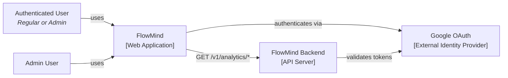
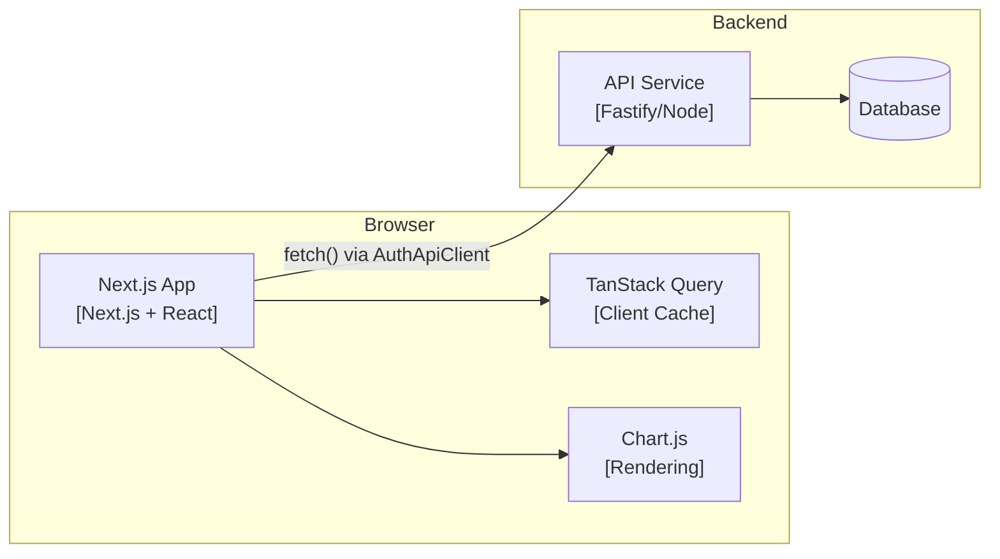
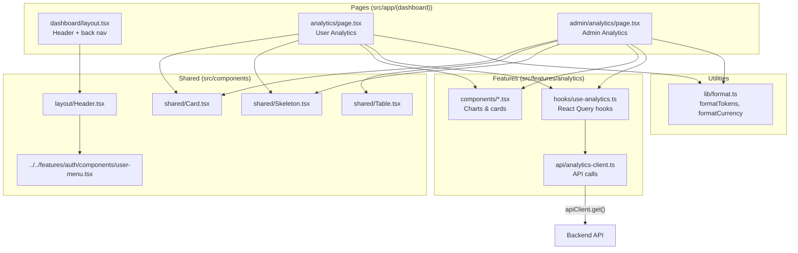

## Context

FlowMind is a single-page chat application with Next.js App Router, `@base-ui/react` primitives, Tailwind CSS v4, and TanStack Query. There are currently no dashboard, analytics, or admin routes — only chat and auth. The application uses a custom `AuthApiClient` (fetch-based) with automatic JWT refresh, and NextAuth for session management.

The `UserProfile` type currently lacks `is_admin` — the backend now returns this field. The user menu (Popover-based) only shows user info and sign-out. The project has no charting library, no Card or Table components, and no skeleton loading components.

Users need visibility into personal token usage. Admins need platform-wide analytics for cost tracking and capacity planning.

## Goals / Non-Goals

**Goals:**
- Provide user analytics dashboard at `/dashboard/analytics` showing total/input/output token usage with daily trends via a line chart
- Provide admin analytics dashboard at `/dashboard/admin/analytics` showing platform usage, per-user usage/cost, feature breakdown, cache breakdown, and peak hours
- Reuse existing Header (with UserMenu) in a new `(dashboard)` route group
- Add analytics navigation items to the UserMenu: "Analytics" for all users, "Admin Analytics" for admins only
- Protect admin routes with a 404 response for non-admin users
- Use chart.js + react-chartjs-2 for all charting
- Animate summary card values from 0 using `motion` (Framer Motion)
- Create reusable Card, Table, and Skeleton components

**Non-Goals:**
- No server-side rendering for analytics pages (client-side data fetching only)
- No real-time updates (data refreshes via React Query staleTime)
- No CSV/PDF export
- No custom date range picker (MVP shows all available data)
- No notification/alert system based on usage thresholds

## Architecture

### System Context (C4 Level 1)

### Container (C4 Level 2)

### Component (C4 Level 3) — Analytics Subsystem

## UI/UX Design System

### Design Direction

Clean, data-dense analytics dashboard that matches FlowMind's existing minimal aesthetic. The analytics pages should feel like a natural extension of the app — same header, same spacing rhythm, but with a focus on readability of numerical data. Use the existing color palette (white background, dark text) and add blue accent tones for data visualization.

### Color Palette

| Role | Hex | Usage |
|------|-----|-------|
| Background | `#ffffff` | Page background — matches existing app |
| Foreground | `#171717` | Text — matches existing app |
| Card Background | `#f8fafc` | Card surface (subtle contrast from page bg) |
| Card Border | `#e2e8f0` | Card border |
| Primary Accent | `#1E40AF` | Chart line, primary data indicators |
| Secondary Accent | `#3B82F6` | Secondary data, interactive elements |
| Success | `#10b981` | Cached tokens (green) |
| Warning | `#f59e0b` | Highlight, peak indicators |
| Muted | `#64748b` | Secondary text, axis labels |

### Typography

No new fonts — reuse the existing system font stack (the project currently uses no custom fonts). Chart labels and numbers use the same font for consistency. The existing text sizing in the app (Tailwind's default scale) is sufficient.

### Spacing & Layout

- Dashboard layout: full-width content area with a max container width
- Summary cards: `grid grid-cols-1 md:grid-cols-3 gap-4`
- Charts: full-width sections stacked vertically, each in a Card
- Cards: `rounded-xl border bg-card p-6` pattern
- Back button: fixed-position ArrowLeft icon in the Header area

### Component Patterns

- **Card**: `rounded-xl border bg-[#f8fafc] p-6` composition with optional title slot
- **Summary Card**: Card variant with large metric value (motion-animated) and label
- **Table**: Simple div/grid-based table with sticky header, alternating row backgrounds, responsive scroll
- **Skeleton**: `animate-pulse bg-gray-200 rounded` placeholders matching card/chart dimensions
- **Chart Wrapper**: Card containing a chart.js canvas with responsive resize handling

### UX Guidelines

- All cards show skeleton placeholders while loading
- Summary values animate from 0 on first load
- Charts show "No data available" when `daily_usage` is empty
- Admin pages show 404 (via `notFound()`) if `user.is_admin !== true`
- 5-minute React Query stale time minimizes unnecessary refetches
- Clickable elements use `cursor-pointer`
- Hover tooltips on all chart data points
- `prefers-reduced-motion` respected for number animations

## Decisions

| Decision | Choice | Rationale |
|----------|--------|-----------|
| Chart library | chart.js + react-chartjs-2 | User preference. Widely supported, no heavy dependencies, good React integration |
| Card component | Custom `Card` component | Project has no card primitive. Creating a lightweight one avoids adding shadcn dependency for a single component |
| Table component | Custom `Table` component | Consistent with Card approach — lightweight, project-specific |
| Summary animation | Framer Motion (`motion`) | Already in the project as `motion` dependency — no new dep |
| Route structure | `(dashboard)` route group with shared layout | Reuses existing Header, adds back navigation, no sidebar |
| Admin protection | `notFound()` for non-admin users | User preference. Simple, secure-by-obscurity pattern |
| Type update | Extend `UserProfile` with optional `is_admin` | Backend returns this field; minimal interface change, no new types |
| API layer | New `AnalyticsApiClient` class in `src/features/analytics/api/` | Follows existing convention (conversation-client.ts, memory-client.ts) |
| React Query pattern | Custom hooks `useUserAnalytics()` and `useAdminAnalytics()` | Matches existing pattern (useProfile, useMemoryUsageQuery) |
| Data refresh | `staleTime: 5 * 60 * 1000` | Analytics data doesn't need real-time freshness. Reduces backend load |

## Risks / Trade-offs

| Risk | Impact | Mitigation |
|------|--------|------------|
| `is_admin` field may not be present in older tokens | Users without field default to non-admin; admins may see 404 | Backward-compatible — optional field. Admins re-login to get updated token |
| Chart.js bundle size | ~80KB gzipped for chart.js + react-chartjs-2 | Acceptable for analytics pages. Lazy-loaded via Next.js dynamic imports if needed |
| No loading states on charts during data fetch | Users see empty chart area briefly | Skeleton components show during loading; `isLoading` + `isFetching` from React Query |
| Large datasets in charts | Performance degradation with 1000+ daily data points | chart.js handles large datasets well; limit to last 90 days on backend if needed |
| Non-admin accessing `/dashboard/admin/analytics` | 404 page — may confuse users who navigated via URL | 404 is standard web behavior. Users can click back or use the app navigation |

## Migration Plan

No data migration needed — this is a new feature. Deployment steps:

1. Add `chart.js` and `react-chartjs-2` to `package.json`
2. Create `src/features/analytics/` directory with API client, hooks, and chart components
3. Create `src/components/shared/Card.tsx`, `Table.tsx`, `Skeleton.tsx`
4. Create `src/lib/format.ts` with formatting utilities
5. Update `UserProfile` type to include `is_admin`
6. Update UserMenu with analytics navigation items
7. Create `src/app/(dashboard)/` route group with layout and pages
8. Verify against tests

Rollback: Remove the `(dashboard)` route group, revert UserMenu changes, remove analytics feature directory.

## Open Questions

- Should chart.js be dynamically imported (`next/dynamic`) to avoid increasing the main bundle? (Charts only appear on analytics pages, so dynamic import makes sense.)
- Should we set a cap on the number of daily data points displayed in the line chart to prevent rendering issues?
