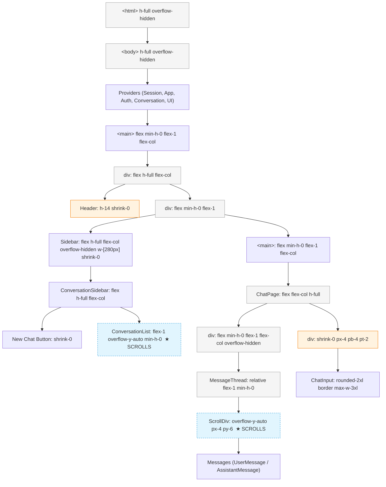

## Context

The current chat layout uses correct flex primitives (`h-full`, `flex-1`, `min-h-0`) but is missing critical `overflow-hidden` guards at the viewport level. The `<html>`/`<body>` elements have `h-full` but lack `overflow-hidden`, allowing page-level scrolling when message content or sidebar content exceeds the viewport. The scroll chain is fragile — `h-full` references on nested flex children resolve correctly only when every ancestor has a definite height, and any break in the chain causes the browser to fall back to `scroll` on `<body>`.

The app targets a single vertical use case: ChatGPT-style conversation UI. There is one layout mode (chat), one fixed header, one sidebar, and one scrollable message list. The layout architecture should guarantee:

- Viewport never scrolls
- Sidebar scrolls independently
- Message list scrolls independently
- Input stays pinned at bottom
- Header stays fixed at top

## Goals / Non-Goals

**Goals:**
- Eliminate all page-level scrolling (`<html>`/`<body>` never scroll)
- Isolate scroll regions: sidebar scrolls independently, message list scrolls independently
- Pin input at bottom of chat panel regardless of message count
- Keep header fixed at top of viewport
- Responsive sidebar: visible on desktop, collapsible drawer on mobile
- Only MessageList uses `overflow-y-auto` in the chat panel

**Non-Goals:**
- No visual redesign (colors, typography, bubble styles unchanged)
- No API or data layer changes
- No animation changes beyond transition properties
- No scrollbar customization (native scrollbars)

## Architecture

### Component Tree — Layout & Scroll Ownership



**Scroll ownership:**
- ★ **ConversationList** — only scrollable element in sidebar
- ★ **ScrollDiv (MessageList)** — only scrollable element in chat panel
- **Every other container** is `overflow-hidden` or doesn't scroll by default

### Layout Sizing Chain

```
Viewport (100vh)
  └─ <html> overflow-hidden
       └─ <body> overflow-hidden
            └─ <main> flex-col flex-1 min-h-0    → height = viewport
                 └─ div flex-col h-full            → height = parent = viewport
                      ├─ Header: h-14 shrink-0     → 56px
                      └─ div flex-1 min-h-0        → height = viewport - 56px
                           ├─ Sidebar: h-full      → height = viewport - 56px
                           │  └─ ConversationList: flex-1 overflow-y-auto
                           └─ <main> flex-1 min-h-0 → height = viewport - 56px
                                └─ ChatPage: h-full
                                     ├─ messsageArea: flex-1 min-h-0 overflow-hidden
                                     │  └─ MessageThread: flex-1 min-h-0
                                     │     └─ ScrollDiv: overflow-y-auto
                                     └─ inputWrapper: shrink-0
```

## UI/UX Design System

This is a layout refactor — the existing visual design system (colors, typography, spacing) is already established via Tailwind/shadcn and is unchanged. The following describes the layout-specific UX patterns.

### Layout Patterns

| Element | Behavior | Rationale |
|---------|----------|-----------|
| Header | Fixed at top, `h-14 shrink-0`, border-bottom separator | Consistent with ChatGPT and most chat UIs; never scrolls |
| Sidebar | Full viewport height, independent scroll; animated width on desktop; slide-in drawer on mobile | Keeps conversation list accessible without affecting message area |
| MessageList | Fills remaining space, `overflow-y-auto`, auto-scrolls to bottom on new messages | Only scrollable area in chat panel |
| ChatInput | Pinned to bottom, `shrink-0`, max-w-3xl centered, border-top separation | Always visible; matches ChatGPT behavior |
| Empty state | Centered in message area, flexbox centered | When no conversation is active |

### Responsive Behavior

| Breakpoint | Sidebar | Chat Panel |
|------------|---------|------------|
| Desktop (≥768px) | Visible, w-[280px], animated open/close via hamburger | Full remaining width |
| Mobile (<768px) | Hidden by default, fixed overlay drawer with backdrop | Full viewport width |

### Mobile Drawer Pattern

- Backdrop: `fixed inset-0 z-40 bg-black/50`
- Drawer: `fixed inset-y-0 left-0 z-50 w-[280px]`
- Open state: `translate-x-0`
- Closed state: `-translate-x-full`
- Transition: `transition-transform duration-300`

## Decisions

| Decision | Choice | Rationale | Alternatives Considered |
|----------|--------|-----------|------------------------|
| Viewport scroll guard | `overflow-hidden` on `<html>` and `<body>` | Most reliable way to prevent page scroll; CSS cascade ensures no child can accidentally enable body scroll | `overscroll-behavior: none` (doesn't prevent scroll, only chokes it) |
| Layout engine | Flexbox | Already the project's pattern; grid adds no value for a single-column chat layout | CSS Grid (would work but inconsistent with codebase) |
| MessageList scroll container | Dedicated inner `<div>` with `overflow-y-auto`, not the component root | Allows parent to have `overflow-hidden` while child scrolls | `overflow-y-auto` on the flex child directly (works but harder to add scroll-to-bottom button) |
| Input positioning | `shrink-0` in flex column | Native flex behavior, no position:absolute hacks | `position: sticky` bottom-0 (works but less reliable with overflow: hidden parents) |
| Sidebar width animation | CSS `width` transition instead of `translateX` on desktop | Native layout flow; sidebar removal collapses space that message area can fill | `translateX` (animates over content, needs overflow handling) |
| Height chain | `h-full` via CSS cascade | Simple, proven pattern when every ancestor has a definite height | `100vh` on each layer (breaks when ancestors add padding/border) |

## Risks / Trade-offs

| Risk | Mitigation |
|------|------------|
| [Nested flex `h-full` chain breaks] → body scrolls | Add `overflow-hidden` on `<html>`/`<body>` as safety net; any break in the chain still won't scroll the page |
| [Mobile sidebar drawer causes horizontal scroll] | Use `overflow-x-hidden` on `<html>`; drawer transforms don't trigger overflow on positioned parents |
| [Long conversation list in sidebar overlaps input on desktop] | `ConversationList` has `flex-1 overflow-y-auto min-h-0` — it shrinks to available space and scrolls internally |
| [Auto-scroll to bottom fights user scroll-up] | Existing `ScrollToBottomButton` pattern handles this; only auto-scroll when user is at bottom |
| [TypingIndicator pushes layout] | Typing indicator is inside the message area (before input), not a separate sticky element |

## Migration Plan

This is a pure CSS refactor — no data migration, no API changes. Implementation strategy:

1. **Phase 1 — Viewport guard**: Add `overflow-hidden` to `<html>` and `<body>` in root layout
2. **Phase 2 — Layout audit**: Ensure every flex parent has `min-h-0` and `overflow-hidden` where appropriate; remove any `h-full` that could resolve incorrectly
3. **Phase 3 — Scroll isolation**: Verify sidebar and message list have exclusive scroll ownership
4. **Phase 4 — Responsive QA**: Test on mobile (drawer, no horizontal scroll)
5. **Rollback**: Revert the root layout change and individual component class changes

## Open Questions

- None — design is fully resolved from the proposal. No ADRs need revisiting.
