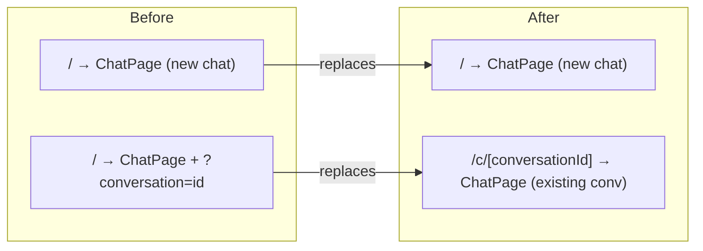
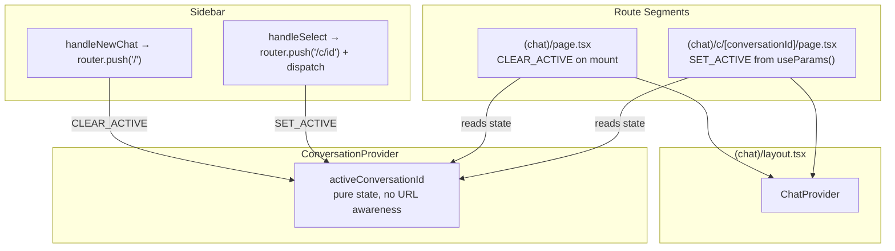
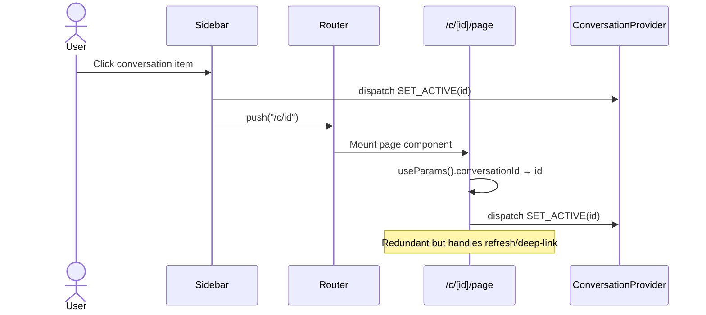
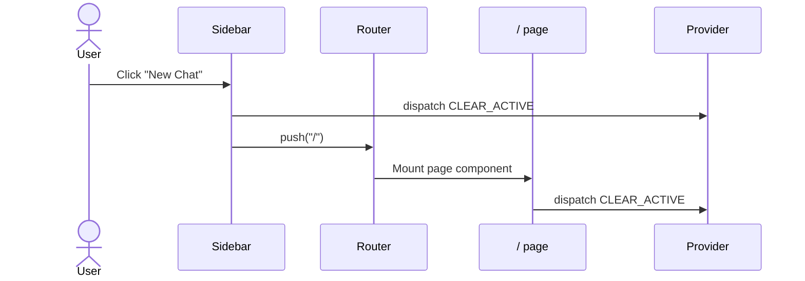

## Context

The current `add-conversation-sidebar` implementation uses URL search params (`?conversation=uuid`) to track the active conversation. The `ConversationProvider` reads `window.location.search` on mount to restore state. The Sidebar navigates via `router.push("/?conversation=id")`.

This approach works but produces messy URLs (`/?conversation=c1a2b3c4`) that don't align with chat app conventions (ChatGPT uses `/c/uuid`). Path-based routing gives cleaner, more shareable URLs and enables proper Next.js route segmentation for future features like per-conversation `<head>` metadata.

This change is purely a routing refactor — no visual UI changes, no data model changes, no CRUD behavior changes.

## Goals / Non-Goals

**Goals:**
- Replace `?conversation=` search param with `/c/[conversationId]` dynamic route segment
- Create `(chat)/c/[conversationId]/page.tsx` that renders chat UI for a specific conversation
- Remove URL parsing from `ConversationProvider` (provider becomes pure state holder)
- Page components own conversation initialization via `useParams()` on mount
- Sidebar dispatches `SET_ACTIVE` on click for immediate UI feedback; page mount handles refresh/deep-link

**Non-Goals:**
- Changing any visual design, UI components, or styling
- Adding conversation metadata to `<head>` (future enhancement)
- Implementing redirects for old `?conversation=` URLs
- Modifying conversation CRUD, mock service, or React Query hooks
- Changing the provider nesting order, auth flow, or streaming mechanism

## Architecture

### Route Structure (Before → After)

### Component Diagram

### Data Flow: Conversation Selection

### Data Flow: New Chat

## Decisions

### D1: Separate route files sharing same layout

**Rationale:** `/` and `/c/[conversationId]` are distinct URL spaces with different initialization logic (CLEAR_ACTIVE vs SET_ACTIVE). They share the same `(chat)/layout.tsx` providing `ChatProvider`. Both render the same `ChatPage` component — only the mount-time dispatch differs. This follows Next.js conventions (one file per route segment) and keeps initialization logic local to each route.

**Alternatives considered:** Single catch-all `[[...slug]]` — rejected because it obscures the two distinct states (new chat vs existing conversation) with conditional logic in one file.

### D2: Page-driven state initialization, provider as pure state holder

**Rationale:** The `ConversationProvider` currently couples to URL structure via `window.location.search`. Removing this makes the provider portable and testable. Each page owns its URL contract: `/` dispatches `CLEAR_ACTIVE`, `/c/[id]` dispatches `SET_ACTIVE`. The provider doesn't need to know route patterns.

**Alternatives considered:** Provider parsing `usePathname()` — rejected because it couples the provider to route structure, making it fragile to route changes.

### D3: Dual dispatch (Sidebar + Page mount)

**Rationale:** The Sidebar dispatches `SET_ACTIVE` immediately when a user clicks a conversation — this gives instant UI feedback (active highlighting in the list). The page mount also dispatches `SET_ACTIVE` from `useParams()` — this handles refresh, deep-link, and browser back/forward where the Sidebar didn't trigger the navigation. The second dispatch is idempotent (same ID → no state change).

**Alternatives considered:** Sidebar-only dispatch — rejected because it fails on page refresh. Page-only dispatch — rejected because there'd be a visible delay between click and active highlight.

### D4: Thin page wrappers, not duplicated ChatPage code

**Rationale:** Both route pages render the same `ChatPage` component. They differ only in their mount-time `useEffect`:
- `(chat)/page.tsx`: `useEffect(() => dispatch(CLEAR_ACTIVE), [])`
- `(chat)/c/[conversationId]/page.tsx`: `useEffect(() => dispatch({ type: "SET_ACTIVE", conversationId }), [conversationId])`

This keeps the chat UI in one place and route-specific logic in the route handlers.

**Alternatives considered:** Moving initialization into `ChatPage` itself — rejected because `ChatPage` would need conditional logic based on whether `useParams()` has a value, coupling it to routing.

### D5: No redirect for old URLs

**Rationale:** This is a development-phase change with no users or bookmarks. Adding redirect logic for `?conversation=` adds complexity with no benefit. When the app goes to production, the URL format will already be path-based.

**Alternatives considered:** Adding a middleware redirect from `?conversation=` to `/c/` — unnecessary overhead for a pre-production app.

## Risks / Trade-offs

| Risk | Impact | Mitigation |
|------|--------|------------|
| Double `SET_ACTIVE` dispatch causes unnecessary re-render | React Query may refetch conversation detail twice | The reducer checks if the ID changed before updating state; `useConversation()` query is `enabled: !!id` so refetch is a no-op if already cached |
| Route file structure adds a file but minimal code | Slightly more files to maintain | Each new page file is ~10 lines — a thin wrapper. If complexity grows, they can be refactored into a single dynamic route later |
| No migration path for old `?conversation=` URLs | Any existing shared links break | Not applicable — no production users yet. Implementation is in development phase |

## Migration Plan

1. **Create route:** Add `src/app/(chat)/c/[conversationId]/page.tsx` — thin wrapper rendering `ChatPage`, dispatching `SET_ACTIVE` from `useParams().conversationId`
2. **Update home page:** Add `useEffect` to existing `(chat)/page.tsx` dispatching `CLEAR_ACTIVE` on mount
3. **Clean ConversationProvider:** Remove `useEffect` that reads `window.location.search` — keep the reducer and state unchanged
4. **Update Sidebar:** Change `router.push("/?conversation=id")` to `router.push("/c/id")` in `handleSelectConversation`
5. **Verify:** TypeScript check, lint, manual smoke test of conversation navigation

**Rollback:** All changes are within the `(chat)` route group and Sidebar. Reverting to search params requires restoring the `ConversationProvider` useEffect (one line) and changing two `router.push` calls. No database, API, or data model changes.

## Open Questions

- **Q1:** Should we add a redirect from `/c/` (without ID) to `/`? Currently navigating to `/c/` without an ID would 404. Adding a `(chat)/c/page.tsx` that redirects to `/` would handle this gracefully.
- **Q2:** Should the `ChatPage` component itself be moved to a shared location (e.g., `@/components/chat/chat-page.tsx`) since it's now rendered from two route segments? Current design keeps it in `(chat)/page.tsx` and re-exports it from the conversation route.
