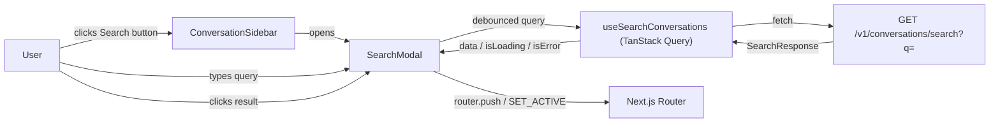

## Context

The application has a sidebar showing the conversation list with a "New Chat" button at the top. Users cannot search across conversations. The backend exposes a REST API at `/v1/conversations` but lacks a search endpoint. The frontend uses Next.js App Router, TanStack Query for server state, and `@base-ui/react/dialog` for modals.

## Goals / Non-Goals

**Goals:**
- Add a search button below the "New Chat" button in the sidebar
- Implement a search modal with debounced input and scrollable results
- Integrate with `GET /v1/conversations/search?q=` API
- Handle all states: initial blank, loading, results, no results, error
- Clicking a result navigates to that conversation and closes the modal

**Non-Goals:**
- Full-text search indexing or backend search logic (backend concern)
- Search filters or advanced query syntax
- Keyboard shortcut to open search (future enhancement)
- Mobile-specific search interaction patterns (uses existing sidebar/modal patterns)

## Architecture

**Component responsibilities:**

| Component | Role |
|-----------|------|
| `ConversationSidebar` | Hosts the search button trigger and wires modal open/close state |
| `SearchModal` | Dialog containing debounced input, results list, loading/empty/error states |
| `useSearchConversations` | TanStack Query hook wrapping `conversationClient.search()` |
| `conversationClient.search()` | `AuthApiClient.get()` call to search endpoint |

## UI/UX Design System

### Design Direction

The search feature follows the existing product design language exactly — no new visual identity. It reuses the same neutral palette (`#F5F5F5`, `#171717`, `#737373`, `#E5E5E5`), border-radius (`rounded-lg`, `rounded-xl`), and interaction patterns (hover transitions, focus-visible rings) found across the sidebar and dialogs.

### States

The modal has four distinct visual states:

1. **Initial (blank)** — Before the user types anything. The results area shows a subtle illustration: a search icon with "Search your conversations" text in neutral-500. This sets expectations and invites action.

2. **Loading** — When a debounced search is in flight. Shows 4 skeleton rows matching the existing `SkeletonRow` pattern (`h-3.5 w-full rounded-md bg-[#F5F5F5] animate-pulse`).

3. **Results** — List of matching conversations. Each item is a two-row card with hover highlight. Shows total count above the list.

4. **No results** — Search completed but found nothing. Shows a message icon with "No results found" and a hint to try different keywords.

5. **Error** — API request failed. Shows error text in `#DC2626` (matching `ConversationList.tsx` error pattern) plus a sonner toast.

### Component Patterns

| Element | Pattern | Source |
|---------|---------|--------|
| Dialog shell | `@base-ui/react/dialog` with `Dialog.Portal`, `Dialog.Backdrop` (`bg-black/50`), `Dialog.Popup` (`rounded-xl bg-white shadow-xl`) | `MemoryModal.tsx` |
| Search input | Native input with `Search` icon, `X` clear button, `rounded-lg`, `bg-[#F5F5F5]` | Sidebar button styling |
| Skeleton | `animate-pulse` with `bg-[#F5F5F5]` | `ConversationList.tsx` |
| Result item | `cursor-pointer rounded-lg hover:bg-neutral-100 transition-colors` | `ConversationItem.tsx` hover pattern |
| Error text | `text-[#DC2626]` | `ConversationList.tsx` |
| Empty state icon | `Search` / `MessageSquare` icon with `text-[#737373]` | `ConversationList.tsx` no-conversations state |

### UX Guidelines

- **Debounce**: 300ms delay before triggering the API call to avoid excessive requests while typing
- **Minimum query length**: 2 characters minimum before search fires
- **Clear button**: Visible only when input has value. Clears input and resets results to blank initial state
- **Auto-focus**: Input is focused when modal opens for immediate typing
- **Click outside**: Dialog closes on backdrop click and Escape key (handled by `@base-ui/react/dialog`)
- **Date display**: `updated_at` shown on row hover as `relativeTime` or `"Today"`/`"Yesterday"`/`"June 12"` format
- **Error handling**: API errors show a sonner toast + inline red text in the results area

## Decisions

| Decision | Choice | Rationale | Alternatives |
|----------|--------|-----------|-------------|
| State management | Local `useState` for modal open/close | Matches `Header.tsx`/`MemoryModal` pattern. No need for global state. | UI store has `OPEN_MODAL` but is unused |
| Data fetching | TanStack Query with `enabled` flag | Consistent with all other data fetching in the app. Built-in caching, error handling, loading states. | Manual `useEffect` + `fetch` would be inconsistent |
| Debounce | Custom `useDebounce` hook | Simple, no dependency needed. The app has no debounce library. | `lodash.debounce` or `usehooks-ts` would add dependencies |
| Query triggering | `enabled: query.length >= 2` | Prevents API calls for empty or single-char queries without extra state | Separate `isSearching` flag would be redundant |
| Search result type | Includes `created_at`/`updated_at` | Required for date display on hover | Original API spec didn't include dates |
| Initial blank state | Static illustration with prompt text | Better UX than empty white space or hiding the results container | Hiding results area entirely would cause layout shift when search starts |

## Risks / Trade-offs

| Risk | Mitigation |
|------|------------|
| API latency on slow connections | Skeleton loading provides immediate feedback. Debounce prevents cascading requests. |
| Large result sets | Results area is scrollable with `overflow-y-auto`. Fixed modal height prevents page scroll. |
| Stale results after sidebar conversation changes | Search results are fetched fresh each query. No caching beyond TanStack Query defaults. |
| Backend search endpoint not yet available | Frontend can be developed and tested against mock data or error state first. |

## Migration Plan

No migration needed — this is a new feature with no impact on existing behavior. The search button is additive in the sidebar.

## Open Questions

- Backend search endpoint contract: confirm `created_at` and `updated_at` fields are included in each `SearchResult` object
