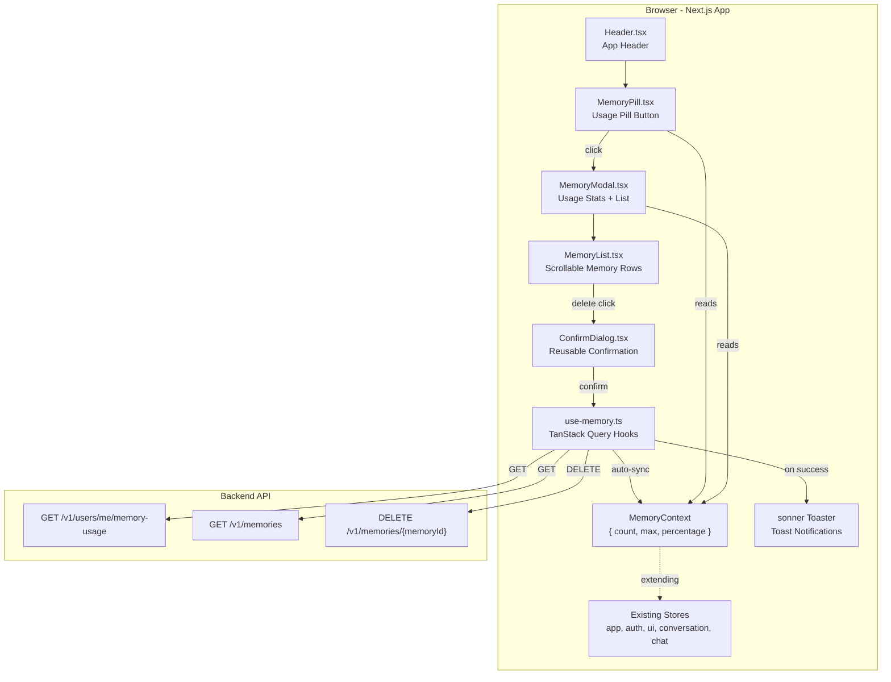

## Context

FlowMind's AI assistant stores memories about users to personalize responses. Currently, users have no visibility into what memories exist, how much memory capacity is used, or how to manage stored memories. Backend APIs exist (`/v1/users/me/memory-usage`, `/v1/memories`, `DELETE /v1/memories/{memoryId}`) but lack a frontend UI.

The existing frontend is a Next.js App Router application with:
- React Context + useReducer for global state (app, auth, ui, conversation, chat stores)
- TanStack React Query for server-state management
- `@base-ui/react` for dialogs and UI primitives
- Tailwind v4 for styling
- No existing toast notification system

## Goals / Non-Goals

**Goals:**
- Expose memory usage percentage in the app header via a compact pill button
- Provide a modal to view detailed usage stats and the full memory list
- Enable deletion of individual memories with confirmation and feedback
- Keep memory usage synchronized across the app (header pill + modal)
- Follow existing codebase patterns for stores, hooks, and components
- Install `sonner` for toast notifications on success/error

**Non-Goals:**
- Editing memories (update/modify existing memory text)
- Creating memories manually
- Bulk delete operations
- Memory search or filtering
- Server-side pagination (the API returns all memories at once)

## Architecture

### C4 Component Diagram (Mermaid)



### Data Flow

```
1. App mounts → MemoryProvider wraps children
2. MemoryPill reads MemoryStore.count / max / percentage
3. MemoryPill click → opens MemoryModal (local useState)
4. MemoryModal mounts → useMemoryUsageQuery fires
5. useMemoryUsageQuery success → dispatches SET_MEMORY_USAGE to MemoryStore
6. MemoryModal renders usage stats + MemoryList
7. MemoryList calls useMemoriesQuery → renders rows
8. useMemoriesQuery success → dispatches SET_MEMORY_USAGE (from response.usage)
9. Delete click → ConfirmDialog → useDeleteMemoryMutation
10. useDeleteMemoryMutation success:
    - invalidateQueries(["memories"])
    - invalidateQueries(["memory-usage"])
    - toast.success("Memory deleted")
11. Memory list auto-refetches via invalidation → re-syncs store
```

### State Shape

```typescript
// MemoryContext state
interface MemoryState {
  count: number;
  max: number;
  percentage: number;
}

// MemoryContext actions
type MemoryAction =
  | { type: "SET_MEMORY_USAGE"; payload: MemoryState }
  | { type: "RESET_MEMORY_USAGE" };
```

## UI/UX Design

### Design Direction

The memory feature is an internal utility within the existing FlowMind app, not a standalone product. It should feel like a natural extension of the existing design system — not draw attention to itself, but be immediately discoverable and functional. The aesthetic risk: **ultra-compact data density with deliberate breathing room**. The pill is intentionally small (the smallest interactive element in the header), but the modal inside holds a dense data table. The contrast between the compact trigger and the full-information modal creates a natural "peek behind the curtain" feel.

### Color Palette

Memory feature uses the existing app palette (neutrals from Tailwind v4, `border-neutral-200`, `text-neutral-900`, etc.) plus three semantic percentage colors:

| Role | Hex | Usage |
|------|-----|-------|
| Low usage | `#16A34A` (green-600) | 0%-49% percentage text |
| Medium usage | `#EA580C` (orange-600) | 50%-79% percentage text |
| High usage | `#DC2626` (red-600) | 80%-100% percentage text |

All other colors derive from existing Tailwind theme (`neutral-*`, `white`, `black/50` for overlay).

### Typography

Follow existing app typography. No new font faces needed. Percentage text in header pill and stats uses the same `text-sm` / `text-base` weights as adjacent UI.

### Spacing & Layout

| Element | Dimensions |
|---------|------------|
| Header pill | `h-7`, `px-3`, `rounded-full`, `text-xs` |
| Modal width | `w-[480px]` (max-w-full on mobile) |
| Memory list container | `max-h-[400px]` with `overflow-y-auto` |
| Row padding | `px-4 py-2.5` |
| Usage stats row | Single line, 3 columns, gap-4 |

### Component Patterns

- **MemoryPill**: `<button>` with fully rounded pill shape, `bg-neutral-100` hover state, lucide `Brain` icon, percentage text colored by threshold
- **MemoryModal**: `@base-ui/react/dialog` with custom styling matching existing DeleteDialog pattern
- **MemoryList**: `<div>` container with fixed max-height and scroll, each row is a flex row with text on left and delete button on right
- **ConfirmDialog**: Generic reusable component (`@base-ui/react/dialog`), accepts `title`, `description`, `confirmLabel`, `onConfirm`, `onClose`
- **Refresh button**: `RotateCw` icon button in modal top-right, spinning animation during loading

### UX Guidelines

- Toast on successful delete: `toast.success("Memory deleted")` — 3s auto-dismiss
- Toast on error: `toast.error("Failed to delete memory")` — manual dismiss
- Refresh button shows loading spinner while refetching
- Confirm dialog "Delete" button is destructive (red text or bg)
- List container has stable height — modal doesn't resize when adding/removing items (scroll container handles overflow)
- Empty state shown in list area when no memories exist: centered text, subtle styling
- Clicking outside modal closes it (default `@base-ui/react/dialog` behavior)

## Decisions

| Decision | Choice | Rationale | Alternatives Considered |
|----------|--------|-----------|------------------------|
| Memory state store | New MemoryContext + useReducer | Follows existing store pattern; header pill and modal both need access without prop drilling | Extend UIState — would couple memory concerns to UI state. Pure TanStack Query — every consumer must use the hook |
| Toast library | `sonner` | Lightweight, modern, shadcn-ecosystem, minimal setup | react-hot-toast — similar but sonner has better Next.js support. Custom context — unnecessary reinvention |
| Modal library | `@base-ui/react/dialog` | Already used in codebase for DeleteDialog | shadcn Dialog — not installed, would add dependency |
| Query key pattern | `["memories"]`, `["memory-usage"]` | Simple, flat, follows conversation key pattern | `["memory", "list"]`, `["memory", "usage"]` — more nesting than needed |
| Modal state | Local `useState` in Header | Matches existing DeleteDialog pattern; memory doesn't need global modal state | `UIState.activeModal` — unused currently, would couple concerns |
| Pill placement | Right side, before UserMenu | Groups interactive controls together, keeps branding clean | Left side would clutter branding area |

## Risks / Trade-offs

- **[No pagination]** The API returns all memories at once. With very large memory stores, initial load could be slow. Mitigation: Current API contract has no pagination; if needed later, a paginated version would require refactoring `useMemoriesQuery` and the list component.
- **[Sonner dependency]** Adding a new npm package. Mitigation: `sonner` is 2kB gzipped, zero-dependency, widely used.
- **[Delete notification]** No existing toast pattern to follow. Mitigation: `sonner` is straightforward — `<Toaster />` in layout, one-liner calls.
- **[Store sync]** Memory usage must stay in sync after every operation. Mitigation: `useMemoriesQuery` success callback dispatches to MemoryStore; `useDeleteMemoryMutation` invalidates both queries so refetch triggers sync.

## Migration Plan

1. Install `sonner`: `npm install sonner`
2. Add `<Toaster />` to root layout or shared layout
3. Create `src/features/memory/types.ts`
4. Create `src/features/memory/store/` (types, reducer, context, provider)
5. Wrap app with MemoryProvider in relevant layout
6. Create `src/features/memory/api/memory-client.ts`
7. Create `src/features/memory/hooks/use-memory.ts`
8. Create `src/features/memory/components/MemoryPill.tsx`
9. Create `src/components/shared/ConfirmDialog.tsx`
10. Create `src/features/memory/components/MemoryModal.tsx`
11. Create `src/features/memory/components/MemoryList.tsx`
12. Add MemoryPill to `src/components/layout/Header.tsx`

Rollback: Remove MemoryPill from Header, remove MemoryProvider from layout, revert package.json and lock file.

## Open Questions

- Should the memory list have any visual differentiation by memory_type (project, user_preference, etc.)? The current API returns `memory_type` but requirements don't specify display differentiation.
- Should the header pill auto-refresh memory usage on a timer (e.g., polling) to catch updates from other sessions? Current design only updates on manual actions.
