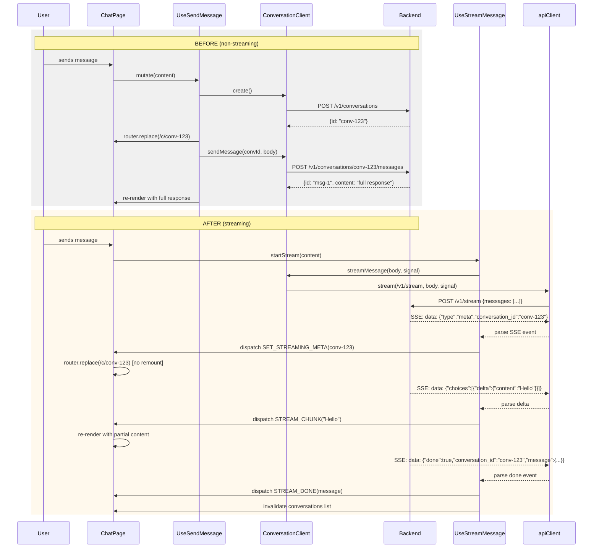

## Context

The chat UI currently uses a two-step synchronous flow: create a conversation via `POST /v1/conversations`, then send a message via `POST /v1/conversations/{id}/messages`. The backend has a `POST /v1/stream` endpoint that accepts `{conversation_id?, messages[]}`, auto-creates conversations, and returns SSE events with OpenAI-compatible delta chunks. The frontend already has an unused `apiClient.stream()` method (ADR-0002) that supports fetch + ReadableStream + AbortController. The migration must not disrupt the existing conversation history loading flow (`GET /v1/conversations/{id}`), sidebar, or any other working UI.

## Goals / Non-Goals

**Goals:**
- Stream assistant responses token-by-token via SSE from `POST /v1/stream`
- Auto-create conversations server-side when `conversation_id` is omitted
- Navigate to `/c/{convId}` on the `meta` SSE event without UI glitch (route consolidation)
- Abort in-flight streams via AbortController
- Remove the old `POST /v1/conversations` + `POST /v1/conversations/{id}/messages` flow
- Invalidate the sidebar conversation list on stream completion

**Non-Goals:**
- No visual redesign of existing components (colors, typography, layout unchanged)
- No changes to `GET /v1/conversations/{id}` for history loading
- No changes to conversation update/delete flows
- No changes to auth, token refresh, or error handling infrastructure

## Architecture

### Data Flow (Before vs After)



### Component Boundaries

```mermaid
flowchart LR
    subgraph Frontend
        CP[ChatPage]
        USM[useStreamMessage hook]
        CC[ConversationClient<br/>+ apiClient.stream()]
        Ctx[ConversationContext<br/>+ ChatContext]
        AM[AssistantMessage<br/>(streaming mode)]
    end
    subgraph Backend
        API[POST /v1/stream]
        MSG[MessageService<br/>stream_add_message]
        LLM[LLM Provider]
    end
    subgraph Data
        DB[(PostgreSQL)]
    end

    CP --> USM
    USM --> CC
    CC --> API
    USM --> Ctx
    CP --> Ctx
    CP --> AM
    API --> MSG
    MSG --> LLM
    MSG --> DB
```

## Decisions

| Decision | Choice | Rationale |
|----------|--------|-----------|
| SSE parsing utility | New `parseSSEStream` function in `conversation-client.ts` | Encapsulates ReadableStream line-by-line parsing, returns typed events. No external dependency. |
| Stream cancellation | AbortController owned by `useStreamMessage`, stored in context | Allows abort from UI (stop button) and cleanup on unmount. |
| Route consolidation | `[[...conversationId]]` catch-all route | Single page component prevents remount during navigation. Same URL patterns `/` and `/c/{id}` work unchanged. Backward/forward navigation unaffected. |
| Streaming state in context | `streamingMessage: { id, content, conversationId }` + `streamAbortController` | Survives route transitions. ChatPage reads from context, renders assistant-message in streaming mode. |
| Conversation list refresh | `invalidateQueries` on `STREAM_DONE` + on `STREAM_ERROR` | Sidebar updates automatically when stream finishes. Same pattern as current `onSuccess`. |
| `create()` removal | Remove `conversationClient.create()` and `sendMessage()` | Only used by `useSendMessage` which is replaced. Existing callers: none besides that hook. |

## Risks / Trade-offs

| Risk | Mitigation |
|------|-----------|
| SSE stream fails mid-way (network, auth expiry) | `STREAM_ERROR` action restores non-streaming state, shows error banner. Tokens already received remain visible. |
| Route consolidation breaks existing bookmarks | Catch-all route matches both `/` (no params) and `/c/{id}` (one param). Works identically. |
| User navigates away during stream | AbortController in context cleanup aborts fetch. No orphaned requests. |
| Simultaneous streams (double-send) | `isSending` flag in context blocks input while stream is active. Same guard as current. |

## Migration Plan

1. **Add types** — SSE event types (`StreamMetaEvent`, `StreamChunkEvent`, `StreamDoneEvent`, `StreamErrorEvent`)
2. **Add SSE parser** — `parseSSEResponse(resp: Response): AsyncGenerator<SSEEvent>` in `conversation-client.ts`
3. **Add `streamMessage()`** — new method on `ConversationApiClient` using `apiClient.stream()`
4. **Extend `ConversationContext`** — add `streamingMessage`, `streamAbortController`, `isStreaming` state and actions (`STREAM_START`, `STREAM_CHUNK`, `STREAM_META`, `STREAM_DONE`, `STREAM_ERROR`, `STREAM_ABORT`)
5. **Create `useStreamMessage` hook** — manages AbortController, consumes SSE generator, dispatches context actions, invalidates queries on done
6. **Consolidate routes** — merge `page.tsx` and `c/[conversationId]/page.tsx` into `[[...conversationId]]/page.tsx`
7. **Update `ChatPage`** — replace `useSendMessage` with `useStreamMessage`, render `assistant-message` in streaming mode when `streamingMessage` is present
8. **Update `AssistantMessage`** — accept `isStreaming` prop, render blinking cursor after partial content
9. **Remove dead code** — `useSendMessage.ts`, `conversationClient.create()`, `conversationClient.sendMessage()`
10. **Test** — verify new chat, existing conversation chat, abort, error, refresh, sidebar update

## Open Questions

- Should the sidebar refresh optimistically on `meta` event (add a placeholder entry) or only on `done`? Current design: refresh on `done` only, matching existing behavior.
