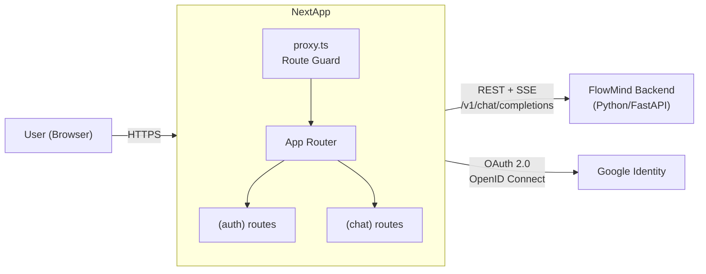
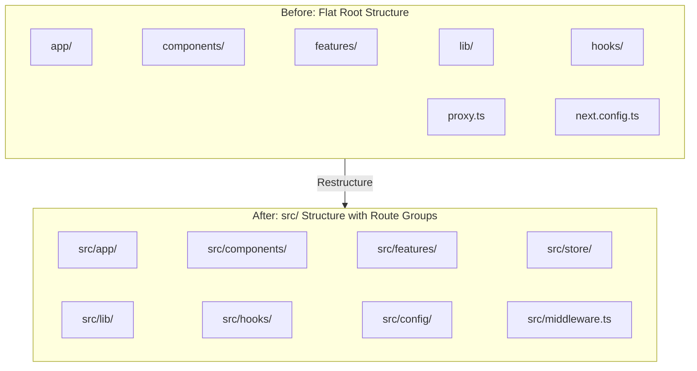
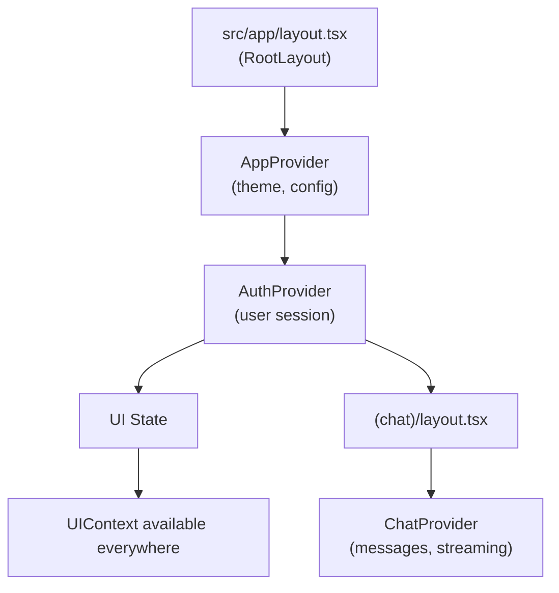

## Context

FlowMind-Frontend is a Next.js 16 App Router chat application currently using a flat root-level directory structure (`app/`, `components/`, `features/`, `lib/`, `hooks/`) without a `src/` wrapper. State management is ad-hoc: React Query for auth server-state, an inline `useReducer` for chat streaming state, and no dedicated context providers. Routes are flat (`app/auth/signin/`, `app/page.tsx`) with no route groups for scoped layouts. Environment variables are accessed directly via `process.env` with no typing.

The project uses shadcn/ui + Tailwind CSS (ADR-0001) and native fetch + ReadableStream for streaming (ADR-0002). Both ADRs remain in force — this restructure does not change those decisions.

## Goals / Non-Goals

**Goals:**
- Establish a conventional `src/` directory wrapping all application code
- Introduce `(auth)` and `(chat)` route groups with dedicated layouts for provider scoping
- Extract state management into dedicated `store/` Context + useReducer providers
- Reorganize components into `layout/` and `shared/` in addition to existing `ui/` and `chat/`
- Add type-safe environment variable access via `src/config/env.ts`
- Add Next.js convention files: `loading.tsx`, `error.tsx`
- Update README with the new folder structure
- Clean up `INSTALL_TEMPLATE.md`

**Non-Goals:**
- No new visual design — existing visual identity preserved (shadcn/ui base-nova, neutral base, Inter typeface via ADR-0001)
- No API route changes — conversation/message routes are out of scope
- No middleware changes — `proxy.ts` stays as-is
- No new dependencies or packages
- No sidebar/chat-history components (deferred)
- No change to the `@/` tsconfig path alias

## Architecture

### System Context (Container Diagram)

### Component Diagram — Before vs After

### Store Architecture

Four Context + useReducer providers, composed in a hierarchy:

| Store | File | State Shape | Source |
|-------|------|-------------|--------|
| `store/app/` | `AppContext.tsx`, `appReducer.ts`, `appActions.ts`, `appTypes.ts` | `{ theme: 'light' \| 'dark' \| 'system', config: AppConfig }` | New |
| `store/auth/` | `AuthContext.tsx`, `authReducer.ts`, `authTypes.ts` | Wraps existing React Query hooks from `features/auth/` | New Context, delegates to React Query |
| `store/chat/` | `ChatContext.tsx`, `chatReducer.ts`, `chatActions.ts`, `chatTypes.ts` | `{ messages: Message[], isStreaming: boolean, error: string \| null }` | Extracted from `use-chat.ts` useReducer |
| `store/ui/` | `UIContext.tsx`, `uiReducer.ts` | `{ sidebarOpen: boolean, activeModal: string \| null }` | New |

**Decision: Why Context + useReducer over external state libraries?**
- Zero new dependencies (project already uses React Query + next-auth)
- useReducer is already in use for chat state — extraction formalizes the pattern
- Context providers compose naturally with React's component tree
- Sufficient for this app's complexity; Zustand/Jotai would be over-engineering at this stage

## UI/UX Design System

### Design Direction

FlowMind is a chat-first AI assistant. The existing visual identity (shadcn/ui base-nova, neutral color base, Inter typeface) is preserved. The folder restructure enables future design iteration but does not change the visual output. New stub components (`loading.tsx`, `error.tsx`, `Spinner.tsx`, `ErrorBoundary.tsx`) follow existing patterns.

### Color Palette (from ui-ux-pro-max analysis)

| Role | Hex | Tailwind | Usage |
|------|-----|----------|-------|
| Primary | `#2563EB` | `blue-600` | Primary actions, links, brand |
| Secondary | `#3B82F6` | `blue-500` | Hover states, secondary elements |
| CTA | `#F97316` | `orange-500` | Send button, call-to-action |
| Background | `#F8FAFC` | `slate-50` | Page background |
| Text | `#1E293B` | `slate-800` | Body text |
| Surface | `#FFFFFF` | `white` | Message bubbles, cards |

Existing shadcn CSS variables (`--primary`, `--secondary`, etc.) already codify these — no change needed.

### Typography

- **Display/Body**: Inter (already configured via Next.js `next/font/google`)
- **Scale**: Tailwind defaults (text-sm for UI chrome, text-base for messages)
- **Code**: Monospace via `react-markdown` code blocks

### Spacing & Layout

- **Container**: `max-w-3xl` for chat messages, full-width for auth pages
- **Gap scale**: Tailwind defaults (gap-2, gap-4, gap-6)
- **Breakpoints**: Responsive at 375px, 768px, 1024px via Tailwind utilities

### Component Patterns

| Component | Pattern | File |
|-----------|---------|------|
| Loading | Centered spinner with "Loading..." text | `src/app/loading.tsx` |
| Error | Centered error message with "Try Again" button | `src/app/error.tsx` |
| Spinner | SVG animation, 24px, primary color | `src/components/shared/Spinner.tsx` |
| ErrorBoundary | Class component, catches render errors, shows fallback UI | `src/components/shared/ErrorBoundary.tsx` |
| Header | Extracted from root layout, logo + user menu | `src/components/layout/Header.tsx` |

### UX Guidelines

- **Loading states**: All async operations show `Spinner` — no blank screens
- **Error recovery**: `ErrorBoundary` provides a "Try Again" action; `error.tsx` offers navigation back
- **Accessibility**: Focus rings visible, `prefers-reduced-motion` respected (no auto-animations)
- **Cursor**: `cursor-pointer` on all clickable elements (buttons, links, interactive cards)

## Decisions

### Decision 1: `src/` wrapper

**Chosen**: Move all application code under `src/`  
**Rationale**: Standard Next.js convention since v13+. Keeps root clean for config files (next.config.ts, tsconfig.json, proxy.ts, .env, etc.). The `@/` alias already points to project root via tsconfig — no alias change needed.  
**Alternative**: Keep flat structure — rejected because root already has 10+ config files and will only grow.

### Decision 2: Route groups `(auth)` and `(chat)`

**Chosen**: Route groups with dedicated layouts  
**Rationale**: Route groups don't affect URL paths but enable scoped layouts. `(chat)/layout.tsx` wraps only chat pages with `ChatProvider`, avoiding unnecessary provider mounting on auth pages. `(auth)/layout.tsx` provides auth-specific UI chrome.  
**Alternative**: Single root layout with conditional providers — rejected because it mounts unused providers and complicates the component tree.

### Decision 3: Store directory with Context + useReducer

**Chosen**: `store/app/`, `store/chat/`, `store/auth/`, `store/ui/`  
**Rationale**: Formalizes the existing ad-hoc state patterns. `chatReducer` extraction is a net improvement — the current inline useReducer in a hook file mixes concerns. Auth store is a thin Context wrapper around React Query (no state duplication — React Query remains source of truth for server state).  
**Alternative**: Zustand — rejected to avoid a new dependency when useReducer already covers the app's complexity level.

### Decision 4: Avatar placement in `shared/`

**Chosen**: Move `components/ui/avatar.tsx` to `components/shared/Avatar.tsx`  
**Rationale**: Avatar is not a UI primitive (unlike Button, Textarea). It's a domain-agnostic shared component used across layouts. `shared/` better communicates its role.  
**Alternative**: Keep in `ui/` — rejected because `ui/` should be shadcn/base UI primitives only.

### Decision 5: Type-safe env config

**Chosen**: `src/config/env.ts` exporting typed constants  
**Rationale**: Prevents runtime bugs from misspelled env vars (`NEXT_PUBLIC_BACKEND_URL` vs `NEXT_PUBLIC_BACKEND`). Single source of truth for all env access. `.env.example` provides onboarding documentation.  
**Alternative**: `t3-env` or `@next/env` — rejected to avoid new dependencies.

## Risks / Trade-offs

| Risk | Mitigation |
|------|------------|
| Import path breakage during file moves | Audit all imports with grep before moving; use `@/` alias in all internal imports; verify build after each batch of moves |
| Store Context wrappers cause unnecessary re-renders | Each Context holds narrow state; use `useMemo` on provider values; `React.memo` on consumers if needed |
| AuthContext wrapping React Query may feel redundant | AuthContext is a thin pass-through — it provides a unified `useAuth()` hook facade but delegates all data fetching to React Query |
| Proxy.ts at root may confuse new devs expecting `middleware.ts` | Document in README; add comment at top of proxy.ts explaining its role |

## Migration Plan

1. Create `src/` with all target directories (empty scaffolding)
2. Create new files first (stores, config, loading, error, shared components) — these have no existing imports to break
3. Move existing files in dependency order: `lib/` → `hooks/` → `components/` → `features/` → `app/`
4. Update import paths after each batch using grep + manual fix
5. Extract store logic from existing hooks (chat reducer → ChatContext)
6. Add route group layouts and update `app/layout.tsx` to compose providers
7. Verify build (`npm run build`) after each major step
8. Update README
9. Remove `INSTALL_TEMPLATE.md`

**Rollback**: Each step is reversible. Git commits between batches enable selective revert. No database migrations or external changes.

## Open Questions

- Should `hooks/` alias in `components.json` be updated from `./hooks` to `./src/hooks`? (Currently `hooks/` is empty — only used as shadcn target. If `hooks/` moves under `src/`, the alias must be updated.)
- Are the chat store types (`ChatState`, `ChatAction`) kept in `store/chat/chatTypes.ts` or left in `features/chat/hooks/use-chat.ts`? Current plan: move to `store/chat/chatTypes.ts` since the store owns the state shape.
